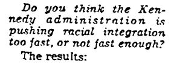
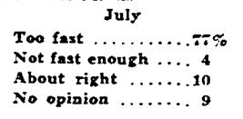
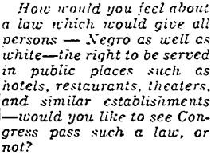
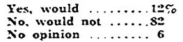

## This is why I "support" majoritarian rule.

 * Originally posted at http://acephalous.typepad.com/acephalous/2010/08/this-is-why-i-support-majoritarian-rule.html
 * Tuesday, August 31, 2010

As a means of registering my discontent with [conservative](http://ace.mu.nu/archives/305216.php) [claims](http://proteinwisdom.com/?p=20740) that the fact that 70 percent of Americans abhor the idea of the "Ground Zero Mosque" means it should be abandoned, I hereby present other things that 70 percent of "certain" Americans once hated.  For example, consider the responses to this question from a Gallup Poll reported in the _Los Angeles Times_ on 14 July 1963.\*

I snipped the June numbers because at that point only 62 percent of respondents had decided that the Civil Rights Movement was moving "Too fast."  I also have other, less inflammatory, examples.  To wit:

That would be from the _Los Angeles Times_ four days earlier.\*\*  I did say I was only referencing "certain" Americans, however, and because I'm an honest chap, I'll tell you that Gallup calls them "Southern Whites."  You heard that correctly: the same conservatives who illegitimately claim the moral high ground Martin Luther King, Jr. struggled to capture have the same high regard for Muslims as Southern segregationists once did for blacks.  To put it finely:

Those who oppose the building of Park51 are justifying their opposition on the fact that the same percentage of Americans are currently as bigoted as Southern whites demonstrated themselves to be when asked how they would "feel about a law which would give all persons—Negro as well as white—the right to be served in public places such as hotels, restaurants, theaters and similar establishments."  All of which is only to say that insisting that this "is" should be enshrined in history as an "ought" makes a person as big of a bastard as a Southern white who couldn't brook the thought of sharing his or her establishments with an African-American.

It's a rebellious stance to be sure, but in the end they'll be standing in a field screaming "Wolverines!" while the world passes them by.

\* Gallup, George. "Views Revised on Rights Push." _Los Angeles Times_ (14 June 1963): M2.

\*\* Gallup, George. "Slim Majority Backs Accommodations Bill." _Los Angeles Times_ (10 July 1963): C18.

* * *

I think this is odd.  Let me know if you agree.  The 71%!o(MISSING)f Americans referenced aren't conservatives, but rather a small subset of Americans.  The Quinnipiac University polled measured the opinions of registered voters in New York State.  What Quinnipiac University is measuring isn't the attitudes of conservatives, of Republicans, or of any ideologically identified sub-group, but all New Yorkers who were motivated and sophisticated enough to register to vote (which may or may not have been a criteria in the Gallup Poll).  And, since New York is a very blue state (When is the last time a Republican presidential candidate won New York? 1984.  How much more did Obama win New York by compared to the national average? 26.9%!v(MISSING)s. 7.2%!W(MISSING)hat does their Congressional delegation look like?  2 Republicans out of 29 total.), some (many/most?) of those antipathetic respondents are going to be liberal Democrats.  

One might think you would appreciate the bipartisanship.

Is antipathetic necessarily the same thing as bigoted?

Posted by: Fritz | [Tuesday, 31 August 2010 at 11:11 PM](http://acephalous.typepad.com/acephalous/2010/08/this-is-why-i-support-majoritarian-rule.html?cid=6a00d8341c2df453ef01348698f662970c#comment-6a00d8341c2df453ef01348698f662970c)

* * *

I'm obviously on your side here, SEK, but I think this is just too convoluted.

Posted by: [tomemos](http://tomemos.wordpress.com) | [Wednesday, 01 September 2010 at 08:46 AM](http://acephalous.typepad.com/acephalous/2010/08/this-is-why-i-support-majoritarian-rule.html?cid=6a00d8341c2df453ef0134869b157b970c#comment-6a00d8341c2df453ef0134869b157b970c)

* * *

I am not sure where you stand on the issue, but I can honestly say that people "down south" on average feel that since this is a "free country", one sould be allowed to worship anywhere they please.  Having said that, I also find that many feel the building should not be used because of the reaction it has caused.  BUT THIS IS A FREE COUNTRY.  We are here because people wanted to be free to practice their faith.  It is why we find so many different ways, in so many different places. This is not what we fought for.  This is as bad as saying illegals having babies here will not make them US citizens. People seem to have forgotten what this country should be doing to protect the rights and freedoms that each one of us has.

Posted by: alkau | [Wednesday, 01 September 2010 at 10:54 AM](http://acephalous.typepad.com/acephalous/2010/08/this-is-why-i-support-majoritarian-rule.html?cid=6a00d8341c2df453ef0133f377aaa1970b#comment-6a00d8341c2df453ef0133f377aaa1970b)

* * *

I can honestly say that people in Murfreesboro, TN and elsewhere around the Nashville area appear to feel that vandalism and arson is the appropriate response to mosques in the area. A lot of them are pretty explicit about the idea that this is not a free country for Muslims. So you'll forgive me if I don't think that any opposition they express to a community center in NYC (a place that, btw, they're pretty explicit about hating and finding un-American) is based on concern about "the reaction it has caused." That's not all southerners, to be sure. But I think Alkau's "on average" assessment of southern attitudes to Islam and its adherents is incorrect.

Posted by: nm | [Wednesday, 01 September 2010 at 01:47 PM](http://acephalous.typepad.com/acephalous/2010/08/this-is-why-i-support-majoritarian-rule.html?cid=6a00d8341c2df453ef0134869e6b64970c#comment-6a00d8341c2df453ef0134869e6b64970c)

* * *

Vapid.  The protest against the mosque has nothing to do with bigotry, and certainly not with civil or religious rights, there are mosques all over New York City, including one that's four blocks from the proposed site, and nobody's picketing them, or even protesting them... in general, New Yorkers don't give a rat's ass about mosques or anything else.  But the proposed site is a direct provocation, a mosque most certainly doesn't belong there, it's patently indecent, which you could divine with a lick of common sense, and if they WERE so concerned, as they claim, with Peace, Love and Understanding, then by now, amidst the furious protests, they would have simply moved the damn thing to wherever Gov. Paterson had offered.  The "Cordoba Initiative", plain and simple, is putting their unholy stamp on their conquest.

Posted by: LJ lejardin | [Wednesday, 01 September 2010 at 11:51 PM](http://acephalous.typepad.com/acephalous/2010/08/this-is-why-i-support-majoritarian-rule.html?cid=6a00d8341c2df453ef0133f3830d01970b#comment-6a00d8341c2df453ef0133f3830d01970b)

* * *

How far is Murfreesboro from Ground Zero? [Too close](http://www.cbsnews.com/stories/2010/08/28/national/main6814690.shtml), apparently. Direct provocation, unholy stamping, etc.

Posted by: SeanH | [Thursday, 02 September 2010 at 04:44 AM](http://acephalous.typepad.com/acephalous/2010/08/this-is-why-i-support-majoritarian-rule.html?cid=6a00d8341c2df453ef0133f3842e2a970b#comment-6a00d8341c2df453ef0133f3842e2a970b)

* * *

LJ, what your dismissal assumes is that an Islamic cultural center represents and stands for the same thing as Al Qaeda. The bigotry comes from the belief that Al Qaeda's beliefs are fundamental to Islam. That all Muslims endorse their ideas and practices. 

Posted by: Jack G. | [Thursday, 02 September 2010 at 01:03 PM](http://acephalous.typepad.com/acephalous/2010/08/this-is-why-i-support-majoritarian-rule.html?cid=6a00d8341c2df453ef013486a9e385970c#comment-6a00d8341c2df453ef013486a9e385970c)

* * *

Shorter LJ LeJardin:

"If they didn't build their mosque there, no one would be so upset."  

Or, in other words:  

"If she hadn't been wearing such a short skirt, that wouldn't have happened to her."

Seriously - stop blaming the victim here. They chose a building that they could afford, that suited their needs, &c. Then people like LJ LeJardin come along and protest, make a stink and just act generally dickish.

Oh, but it's not your fault! You're not a bigot! You were provoked! It's not MY fault I'm upset! The Muslims started it! 

Seriously - you're using a child's playground argument. "They started it!!!" All this without even considering that - maybe there was no other place they could afford? That they, themselves, are as much victims of the New York real estate market as you are of their building plan? 

Oh, but, you're right. I'm sorry - it's not YOUR fault you're a jerk - it's the Muslims' fault for building something where you don't like it. To use another classic playground argument - who died and made YOU king?

Posted by: Chester Bogus | [Thursday, 02 September 2010 at 01:11 PM](http://acephalous.typepad.com/acephalous/2010/08/this-is-why-i-support-majoritarian-rule.html?cid=6a00d8341c2df453ef0133f3865a93970b#comment-6a00d8341c2df453ef0133f3865a93970b)

