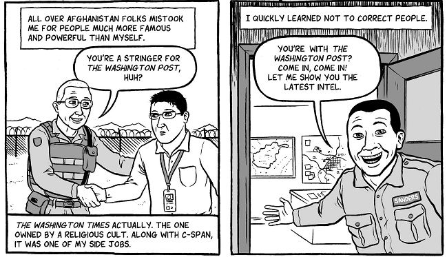
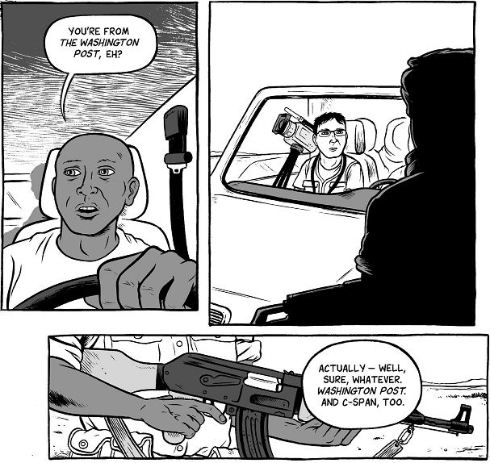
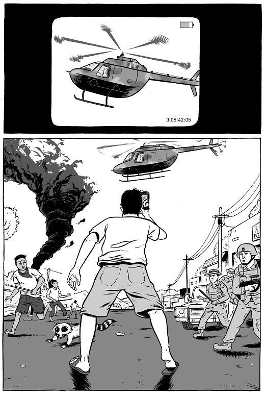

## <em>War Is Boring</em> I

 * Originally posted at http://acephalous.typepad.com/acephalous/2010/09/war-is-boring-i.html
 * Tuesday, September 07, 2010

[_I'm breaking this review into separate posts.  Part II will be up tomorrow._]

David Axe's [_War Is Boring_](http://www.amazon.com/exec/obidos/ASIN/0451230116/diesekoschmar-20) belongs, in a very general sense, to the grand tradition of American road trip narratives. Unlike Steinbeck's _Travels with Charley_, in which the Nobel Laureate set out to reconnect with an idea of America; or Thompson's _Fear and Loathing in Las Vegas_, in which the good doctor set out to obliterate that notion altogether; or Pirsig's _Zen and the Art of Motorcycle Maintenance_,  in which a creative writing professor ignores both the country and all  notions of it in favor of calling attention to his own profundity—that  is to say, unlike _those_ nonfictional account of road trips by American authors, the travel narrative that frames _War Is Boring_ is not aimed at an American audience. I mean this literally: Axe  recalls the past five years of his life as a United Nations van and its  driver, Adrian Djimdim, shepherd him across Chad. That he tells his  story to someone who has experienced life in a conflict zone is  significant because it allows him the sympathetic space required to  recount the intimate moments and minor worries of combat life without  seeming a solipsist.

The wars to which he flashes back in conversation are not about him  in the way that Salinas is about Steinbeck, Las Vegas about Thompson, or  Pirsig about Pirsig. They are not an extension of himself because _War Is Boring_ partakes of no Emersonian "upbuilding of a man" and Axe refuses to  serve as a delegate for our moral improvement. For example, later in the  novel, after being mistaken for former U.N. weapons inspector Hans  Blix, he informs Djimdim that:

As Djimdim is presented as an observant listener, he must have recognized that Axe had fed him a similar line earlier:

Note that the difference is not in growth, but simple addition: Axe  doesn't correct him, he merely adds the names of his actual employers,  committing what could be called a sin of omission by addition. He  presents himself here not as a model to be emulated, but a person for  whom old, successful habits die hard—that is, as a sympathetic example  of our flawed species.\* But _War Is Boring_ is always as much about  the narrative as it is the narrator, even when the stakes of the  conflicts narrated are not altogether clear. While that might seem a  criticism of the book, I don't mean it as such. The view from the ground  will always be more chaotic than its aerial equivalent, as Axe himself  argues via juxtapositions like those that open his chapter on East  Timor:

The helicopter is as isolated from the events below as it is in Axe's  camera, but for the moment, so is Axe. That first panel fails to inform  us whether the narrative is in its Chadian frame or East Timor, and the  second one only provides visual clues as to when and where we are.  Moreover, the perspective Axe and, through him, the reader has on that  helicopter is [a familiar and unpleasant one](http://www.library.cornell.edu/olinuris/ref/helicopter.jpg): the isolation of the helicopter somehow representing both imperialist ambitions _and_ the sinking feeling in a soldier's gut as his last connection to a life  outside of war pulls into the sky. In fact, this framing of the  conflict occurs throughout the chapter on East Timor, neatly paralleling  the fact that Axe feels like he learned little in the two weeks he  spent there.

\* If I seem excessively focused on the personal or confessional aspects of the narrative, it's likely because I'm working on [my lesson plans](http://acephalous.typepad.com/acephalous/2010/07/fall-comics-courses-american-manga-and-coming-of-age.html) at the moment, and _War Is Boring_ slots in nicely with the theme of "Confessional Comics." Reading it in conjunction with Craig Thompson's [_Blankets_](http://www.amazon.com/exec/obidos/ASIN/1891830430/diesekoschmar-20),  the content of which could hardly be more different, makes plain one of  Axe's strengths as a novelist: his willingness to depict his  self-important or oblivious behavior, as in the "Detroit" chapter,  bolsters his credibility throughout.

* * *

I haven't read anything by David Axe.  I've read almost everything by Joe Sacco.  This looks, based on these few panels, a lot like a Sacco clone to me.  Any idea of whether that's true?  Sacco not only does the "depict his self-important or oblivious behavior" thing, he overdoes it, giving me as a reader the sense that his self-dislike is a mask rather than a credibility booster.  Of course, I'd probably be even more suspicious of something that looked like it was supposed to be a credibility booster.

Posted by: [Rich Puchalsky](http://rpuchalsky.blogspot.com) | [Tuesday, 07 September 2010 at 01:55 PM](http://acephalous.typepad.com/acephalous/2010/09/war-is-boring-i.html?cid=6a00d8341c2df453ef0133f3f103f3970b#comment-6a00d8341c2df453ef0133f3f103f3970b)

* * *

He's quite familiar with Sacco, and quite a bit different.  The art, by Matt Bors, is a lot cleaner and more cartoonish than Sacco's.  I'll expand on that more tomorrow when I deal with the art specifically.  (And I already had a Sacco comparison worked in, so you're not seeing nothing there.)

Posted by: [SEK](http://acephalous.typepad.com) | [Tuesday, 07 September 2010 at 02:06 PM](http://acephalous.typepad.com/acephalous/2010/09/war-is-boring-i.html?cid=6a00d8341c2df453ef0133f3f116df970b#comment-6a00d8341c2df453ef0133f3f116df970b)

* * *

Looks, interesting, will have to procure.

Did you ever see "Waltz with Bashir," and if so what did you think of it?

Posted by: JPool | [Tuesday, 07 September 2010 at 04:25 PM](http://acephalous.typepad.com/acephalous/2010/09/war-is-boring-i.html?cid=6a00d8341c2df453ef01348714097e970c#comment-6a00d8341c2df453ef01348714097e970c)

