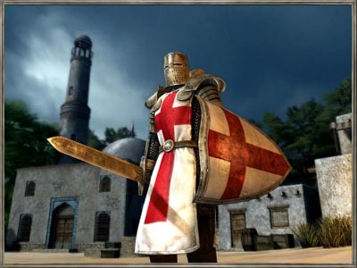

## I see what you did there.

 * Originally posted at http://acephalous.typepad.com/acephalous/2010/10/i-see-what-you-did-there.html
 * Wednesday, October 06, 2010

Wendy A. Goldman [took to _Big Hollywood_](http://bighollywood.breitbart.com/wgoldman/2010/10/04/introducing-crusader-pictures-movies-the-culture-war-and-restoring-sanity/) today and unveiled her new production company like a student communicating in her introduction that her entire essay will be filler:

> Movies have the power to make us laugh or cry, to anger or inspire us, to move us, or just to provide escape. And, sometimes, they have a power beyond simple entertainment; they can influence new ways of thinking, feeling and pursuing our lives.

Those are the kinds of sentences that you write when you’re not trying to say anything, not when you’re trying to introduce your new production company to the world. Her second paragraph is a marginal improvement, as it at least indicates why she feels the world needs another generic person to start another pointless production company:

> Movies are also one of the primary arenas in which the so-called “culture war” is fought, where the battle for the hearts and minds of the public, and the conflict between values considered traditional and conservative, and those considered progressive or liberal is played out—reaching people in a profound, instinctive way.

What a precise and crisply written sentence. If she thinks as clearly as she writes, she deserves the seed money required to battle the conflict between traditional and conservative values and reach people in a more profoundly instinctive way. In short, despite all her talk of battles and conflicts, hers is a peaceful company whose conflict battlers will be merely metaphorical:

> It is with this in mind that we have launched [Crusader Pictures](http://www.crusaderpictures.com/). Crusade means the vigorous advancement of a cause, and the cause at the heart of Crusader Pictures is to produce entertainment which stands up for individual liberty in a manner that will appeal to a wide audience.

She thinks “crusade” means _what_ now? Because according to the final authority on the matter, the _Oxford English Dictionary_, it means:

> **1. a.** _Hist._ A military expedition undertaken by the Christians of Europe in the 11th, 12th, and 13th centuries to recover the Holy Land from the Muslims.
> 
> **b.** _transf._ Any war instigated and blessed by the Church for alleged religious ends, a ‘holy war’; applied esp. to expeditions undertaken under papal sanction against infidels or heretics.
> 
> **2.** _fig._ An aggressive movement or enterprise against some public evil, or some institution or class of persons considered as evil.
> 
> **3.** A papal bull or commission authorizing a crusade, or expedition against infidels or heretics.
> 
> **4.** _Span. Hist._ A levy of money, or a sum raised by the sale of indulgences, under a document called _Bula de la cruzada_, originally for aggression or defence against the Moors, but afterwards diverted to other purposes.
> 
> **5. a.** A marking with the cross; the symbol of the cross, the badge borne by crusaders.
> 
> **b.** _fig._ (with allusion to ‘cross’ in the sense of trial or affliction).

Note the common thread there? “Crusade” does not mean “the vigorous advancement of a cause,” but

> **1. a.** the vigorous advancement of a Christian cause against Muslims,
> 
> **b.** people like Muslims,
> 
> **2.** or people generally considered evil;
> 
> **3.** it can also refer to the document that authorizes the above,
> 
> **4.** the money that finances it,
> 
> **5. a.** the symbol that justifies it,
> 
> **b.** or the suffering all of that entails.

_That_ is what “crusade” means, so her “subtle” attempt to strip it of that context and transform it into some innocuous synonym for political engagement will—_wait_, she included a picture with this post? I can’t view images through the RSS feed, but I’m sure it’s just some patriotic pablum to distract non-dogs from the shrill of her whistle:
		

Or not.  The Tea Party movement may be a fractious coalition of fiscal and Christian conservative groups, but they share a common commitment to [doubling-down when they should be saving face](http://www.lawyersgunsmoneyblog.com/2010/10/last-word-on-the-donalde-until-the-next-one).

**UPDATE:**Google image search provides [the origin of the image](http://www.neocoregames.com/index.php?action=2&stid=crusaders) on the first row of an image search for the word "Crusader."  The description of the game is rather ... telling.   

* * *

Yikes! The only thing missing from that picture is a white hood, but it's hardly necessary with that helmet.

What would the late Bernie Schwartz say, he who did NOT say, "yonder doth lie the castle of my fodder." Looks like this dude woulda' crusaded Bernie right outa Hollywood. No Bernie, no Jamie Lee Curtis. No Jamie Lee, no Trading Places. No Trading Places, no Eddie Murphy running the show.

Posted by: [Bill Benzon](http://new-savanna.blogspot.com/) | [Wednesday, 06 October 2010 at 04:46 PM](http://acephalous.typepad.com/acephalous/2010/10/i-see-what-you-did-there.html?cid=6a00d8341c2df453ef0133f4e47493970b#comment-6a00d8341c2df453ef0133f4e47493970b)

* * *

I checked out the link to the company's website. Seriously, they want people to invest hundreds of thousands (if not millions) on a project with that website design?  I've seen sites for plumbers that looked better and could be taken more seriously.  (That's not a slam against plumbers, it's just you don't normally associate them with great webdesign.)

Posted by: james suhr | [Wednesday, 06 October 2010 at 06:08 PM](http://acephalous.typepad.com/acephalous/2010/10/i-see-what-you-did-there.html?cid=6a00d8341c2df453ef01348804a8e9970c#comment-6a00d8341c2df453ef01348804a8e9970c)

* * *

According to the same OED, Thomas Jefferson, noted intolerant Christian, stripper of context, conservative asshole, racist, and etc..., wrote in 1786, "Preach, my dear Sir, a crusade against ignorance."

What?

Posted by: [Fritz](http://fmhemker.blogspot.com) | [Wednesday, 06 October 2010 at 07:24 PM](http://acephalous.typepad.com/acephalous/2010/10/i-see-what-you-did-there.html?cid=6a00d8341c2df453ef0134880501c0970c#comment-6a00d8341c2df453ef0134880501c0970c)

* * *

You know, that Crusade game would be more interesting if they picked a Crusade that wasn't guaranteed to succeed, or set it in the inter-Crusade Crusader state wars. Also, I'm pretty sure that using someone else's almost-certainly-trademark-protected CGI to announce your commercial venture means that your corporate counsel has to start yelling at you from day 1, instead of having a honeymoon of subtle subterfuge.

Posted by: [Ahistoricality](http://ahistoricality.blogspot.com) | [Wednesday, 06 October 2010 at 07:53 PM](http://acephalous.typepad.com/acephalous/2010/10/i-see-what-you-did-there.html?cid=6a00d8341c2df453ef01348805206e970c#comment-6a00d8341c2df453ef01348805206e970c)

* * *

Looks like Ms. Wendy Goldman isn't going to be launching any crusades against IP rip-offs.

Posted by: [Bill Benzon](http://new-savanna.blogspot.com/) | [Wednesday, 06 October 2010 at 09:49 PM](http://acephalous.typepad.com/acephalous/2010/10/i-see-what-you-did-there.html?cid=6a00d8341c2df453ef01348805a2d8970c#comment-6a00d8341c2df453ef01348805a2d8970c)

* * *

Jesus, even the damn crusaders knew that if you're gonna just rip a pic off from a Google image search, you take it from page 27, not page 1.

Posted by: [nutellaontoast](http://firemeganmcardle.blogspot.com) | [Friday, 08 October 2010 at 05:39 PM](http://acephalous.typepad.com/acephalous/2010/10/i-see-what-you-did-there.html?cid=6a00d8341c2df453ef0134880feb28970c#comment-6a00d8341c2df453ef0134880feb28970c)

* * *

"According to the same OED, Thomas Jefferson, noted intolerant Christian, stripper of context, conservative asshole, racist, and etc..., wrote in 1786, "Preach, my dear Sir, a crusade against ignorance."

What?"

And if Jefferson were any of the above (he was racist, but I doubt he was all that bad by the standards of his time, and don't see why you brought it up since the topic here seems to be Goldman's religion-based bigotry rather than race-based bigotry), or to scrupulously give the benefit of the doubt let's say two of the above, it would be totally natural to jump to the conclusion that the venture he was talking about was bigotry hidden disingenuously under more neutral language. Since he wasn't, though, and the average person at _Big Hollywood_ is all of the above, your point, assuming I understand you at all, is misguided if not misleading.

Posted by: [Cyrus](http://cybishop.blogspot.com) | [Friday, 29 October 2010 at 10:32 AM](http://acephalous.typepad.com/acephalous/2010/10/i-see-what-you-did-there.html?cid=6a00d8341c2df453ef0133f56ee1a9970b#comment-6a00d8341c2df453ef0133f56ee1a9970b)

