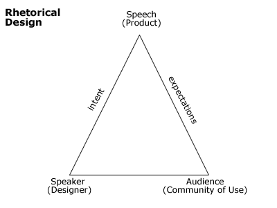

## What is "violent rhetoric"? 

 * Originally posted at http://acephalous.typepad.com/acephalous/2011/01/what-is-violent-rhetoric-.html
 * Monday, January 10, 2011

As someone who teaches rhetoric, I can only say that I've been profoundly disappointed in the quality of the conversation about the assassination attempt on Gabrielle Giffords.  Despite all the condemnation of everyone else's "violent rhetoric," I've yet to see one post in which the term itself is defined.  It seems to mean, in the current political vernacular, anything said by someone else that involves anything even remotely violent.  Katrina Trinko's [attempt](http://www.nationalreview.com/articles/256747/mr-civility-katrina-trinko) to _tu quoque_ Keith Olbermann is particularly enlightening, as it describes a number of angry statements by Olbermann that are neither violent nor rhetorical, _e.g._

> In 2007, Olbermann called rival network Fox News “worse than al-Qaeda ... for our society” and said the channel was “as dangerous  as the Ku Klux Klan ever was.”

Neither of those statements are rhetorical because neither of them attempts to call its audience to action.  For them to be rhetorical, [as per Aristotle in _On Rhetoric_](http://classics.mit.edu/Aristotle/rhetoric.1.i.html), they would need to be intended to _persuade_.  Moreover, they would need to be intended to persuade _a particular audience_ to undertake _a particular action_.  This is the rhetorical triangle:

Note the interconnectedness of the speaker and audience.  The general problem with discussing rhetoric in the current media  environment is that the particularity of the audience is absent.  Anyone  can read or watch or listen to anything without regard for their  relation to the intended audience and without reference to the action  whose commission the rhetor intends.  In such a situation, it is not surprising when the mode of persuasion favored by speakers is the one that is most effectively general.  To quote Aristotle again:

> The first [mode of persuasion] depends on the personal character of the speaker [_ethos_];  the second on putting the audience into a certain frame of mind [_pathos_]; the third  on the proof, or apparent proof, provided by the words of the speech itself [_logos_].

Though _pathos_ is typically translated as an "appeal to emotion," it is better understood as an "appeal to imagination."  Anything that stokes the imagination, be it an image or a narrative, fits the bill.  It goes without saying that the majority of political rhetoric in America is, in this technical sense, pathetic.  This is simply because most politicians have questionable _ethos_ and very few have speechwriters sufficiently talented to produce persuasive _logos_.  But it is also because most Americans are too suspicious of political motives to allow politicians to establish an _ethos_ and too untrained in the literary arts to understand an appeal to _logos_. 

Typically, then, we are left in a situation in which politicians, as rhetors, design speeches whose _pathos_ is general enough to appeal to as wide an audience as possible.  It stands to reason that if we want to understand what "violent rhetoric" entails, we must focus on whose images and stories are stoking whose imaginations _and to what effect_.  Pointing out that Keith Olbermann associated Fox News with terrorist organizations foreign and domestic does nothing of the sort because the audience and intended effect of his statements is unclear.  How unclear?

If we posit his intended audience is liberals and leftists who believe President Obama is a centrist—which strikes me as a fairly accurate assessment—then we need to ask what the intended effect _on that particular audience_ of associating Fox News with al-Qaeda would be.  Keeping in mind that we are currently at war with al-Qaeda, are we to believe that Olbermann is encouraging liberals and leftists to join a military-like organization and wage an Afghanistan-type offensive against Fox News?  Given that his audience is composed of people who are, generally speaking, opposed to war, does that make any sense?  Or is it more likely that he is simply attempting to create an association of like-with-like in which the likeness is supremely unflattering?  His rhetoric here is pathetic and inflammatory, but from the perspective of what it is intended to persuade its audience, it is also incoherent.  It can't be considered "violent" because it in no way encourages its audience to have its imagination stoked by reference to violence.

Consider a slightly more infamous example:

   

Here the intended audience is those who believe President Obama is a radical leftist and associates itself with the center-right.  Unlike the audience of liberals and leftists, who oppose war and favor a restrictive interpretation of the Second Amendment, this audience is more hawkish and more likely to support of an expansive interpretation of the Second Amendment.  I would contend that this is an example of "violent rhetoric" not because it contains crosshairs aimed at "the candidates" who represent "the problem" in need of "solution," and despite the fact that talking about "solving" human beings has a rather untoward history, but because its violence is a product of whose imaginations are being stoked and how it is being done. 

The intended effect of this image is _not_ to encourage the assassination of candidates; however, the pathetic appeal being made to this particular audience is certainly intended to stoke their imaginations in ways related to their ideological belief in an expansive interpretation of the Second Amendment.  This rhetoric is violent, then, because it was intended to appeal to an audience whose imaginations would be stoked by a reference to shooting things.  The same cannot be said of [this similar map](http://patterico.com/2011/01/09/left-and-media-but-i-repeat-myself-in-a-fact-free-frenzy-to-blame-palin-for-giffords-shooting/):

   

Why not?  Are bullseye that different from crosshairs?  Of course not.  However, the intended audience is: the imaginations of liberals and leftists who support a restrictive interpretation of the Second Amendment are not stoked by images of bullseyes.  They generally have no pathetic investment in crossbows and so appeals of this sort are less likely to be effective than those like the one above.  In terms of rhetoric, then, only the first of these two maps can be designated as "violent" because only it attempts to persuade its audience into action by stoking imaginations by referencing shooting things.\*

So now that we have something resembling a proper working definition of "violent rhetoric," the next question is whether "violent rhetoric" like Palin's is responsible for the assassination attempt on Gifford.  The answer is that I'm not convinced.\*\*  From what I've read, he never expressed interest in guns until last November, so the likelihood of ads like hers stoking his imagination is slim.  The more pernicious rhetoric here is the conspiratorial variety being mainstreamed by the likes of Glenn Beck: rabid and ahistorical anti-federalism feeds into the beliefs of those who believe they're being persecuted by vast faceless conspiracies. 

\* I suppose one possible objection is that shooting is not, in and of  itself, a violent act, but given that it specifically links the  crosshairs to candidates, I think that would be a difficult argument to  make here.

\*\* That said, I do believe whichever party was responsible for the dismantling the mental health system—generally in the 1980s and more recently in Arizona—and consistently lobbies for fewer restrictions on the purchasing of powerful weaponry is partly culpable for what happened on Saturday. 

* * *

Wow, this is good.  I had some thoughts on this from a historical perspective ([http://bit.ly/htZ0Q1),](http://bit.ly/htZ0Q1),) but this is better.  

Posted by: [Matt Gabriele](http://modernmedieval.blogspot.com/) | [Monday, 10 January 2011 at 06:12 PM](http://acephalous.typepad.com/acephalous/2011/01/what-is-violent-rhetoric-.html?cid=6a00d8341c2df453ef0147e173a88c970b#comment-6a00d8341c2df453ef0147e173a88c970b)

* * *

This is good, but the assertion that Palin's rhetoric is violent and Olbermann's isn't is entirely founded on the assumption that Palin's fans are violent and Olbermann's are not, and that seems to me as very close to begging the question, doesn't it?

I mean, I think you could also say that liberals are OK with violence against perceived wrong doers, since many of them support the use of police violence (though I don't and mI think you prolly don't either.) and so couldn't you argue that Olbermann's likening to two outlaw organizations against whom violence would be justified is the same thing?  I'm not saying I believe that, just that I think when you have to draw such a fine line to distinguish the two modes of speech that maybe they aren't that different after all.

So yea, define violent rhetoric and contextualize specifically enough and it may hold up logically, but it still comes off to me as the pot calling the kettle a slidely different shade of black.

Otherwise, you're basically defending the assertion that the right has a monopoly on violent rhetoric, which seems dismissable out of hand.

Posted by: nutellaontoast | [Monday, 10 January 2011 at 06:56 PM](http://acephalous.typepad.com/acephalous/2011/01/what-is-violent-rhetoric-.html?cid=6a00d8341c2df453ef0147e173ec4e970b#comment-6a00d8341c2df453ef0147e173ec4e970b)

* * *

@Matt: Thanks!

@NOT:

_but the assertion that Palin's rhetoric is violent and Olbermann's isn't is entirely founded on the assumption that Palin's fans are violent and Olbermann's are not_

Not really: they're defined as people more likely to favor an expansive interpretation of the Second Amendment, which doesn't necessarily make them more violent, just more prone to have their imaginations stoked by imagery related to guns.

_you're basically defending the assertion that the right has a monopoly on violent rhetoric, which seems dismissable out of hand._

If that were the extent of violent rhetoric instead of an example of it, I'd agree ... but to reverse what I wrote, it makes sense that imagery of the sort Palin used wouldn't be nearly as effective on Olbermann's audience, no?

Posted by: [SEK](http://acephalous.typepad.com) | [Monday, 10 January 2011 at 07:07 PM](http://acephalous.typepad.com/acephalous/2011/01/what-is-violent-rhetoric-.html?cid=6a00d8341c2df453ef0147e173ff43970b#comment-6a00d8341c2df453ef0147e173ff43970b)

* * *

What Matt said

Posted by: [Blogenspiel.blogspot.com](http://profile.typepad.com/blogenspielblogspotcom) | [Monday, 10 January 2011 at 07:45 PM](http://acephalous.typepad.com/acephalous/2011/01/what-is-violent-rhetoric-.html?cid=6a00d8341c2df453ef0148c77dd095970c#comment-6a00d8341c2df453ef0148c77dd095970c)

* * *

This is a fine definition, however the fact that it excludes the Clear and Present Danger Test is — in my frank opinion — inappropriate. Oliver Wendell Holmes was faced with this type of problem in 1919, in _Schenck v. the United States_. Another important Supreme Court case to consider in this imbroglio is 1969's _Brandenburg v. Ohio_.  Although I'm no legal professional, it is my opinion that these rulings should inform us as to what "dangerous" speech happens to be — especially since they are what would really matter in this situation. 

 Naturally, the definition is subjective: the audience does, as you said, matter; also, the call to action matters: how clear is it? Stroking the imagination is one thing, but it is another thing, in my opinion, to speak in depth and at length about a given action. From the perspective of a layman, it seems like this could easily turn into a difficult case to prosecute — if it were brought against Sarah Palin. Hal Turner's case was a no brainer, but Palin's, if it were brought into court, would probably not be an easy conviction; it is very likely, depending on the court, that the case could even be thrown out. At least, this is a layman's interpretation of the decisions. 

"The Court upheld the statute on the ground that, without more, "advocating" violent means to effect political and economic change involves such danger to the security of the State that the State may outlaw it. Cf. Fiske v. Kansas, 274 U.S. 380 (1927). But Whitney has been thoroughly discredited by later decisions. See Dennis v. United States, 341 U.S. 494, at 507 (1951). These later decisions have fashioned the principle that the constitutional guarantees of free speech and free press do not permit a State to forbid or proscribe advocacy of the use of force or of law violation except where such advocacy is directed to inciting or producing imminent lawless action and is likely to incite or produce such action." _Hess v. Indiana_.

Again, it seems that Turner's case is a no brainer — especially considering that he published information on the people he was threatening — but one brought against Palin would be a bit harder to prosecute. It will definitely, if it is brought to court, come down to the text on the picture: "Help us prescribe the solution." The trial will probably be highly politicized, and, like many things involving Sarah Palin, have a circus atmosphere peculiar to her. Does this inspire imminent lawless action? is the text a clear and present danger to the listed candidates? and is the call to action clear? are all questions which should be asked; but, it's more likely that none of them — the important questions, or their important answers — will make their way to the viewers ears in the emotionally charged fracas. 

Presumably, one against Glenn Beck could be just as hard; although I haven't regularly watched his program since he switched to Fox News, so all bets are off. 

Posted by: That Guy | [Monday, 10 January 2011 at 09:35 PM](http://acephalous.typepad.com/acephalous/2011/01/what-is-violent-rhetoric-.html?cid=6a00d8341c2df453ef0147e174ebc1970b#comment-6a00d8341c2df453ef0147e174ebc1970b)

* * *

Not really necessary for a second post, but sincerest apologies for the italics faux pas. 

Posted by: That Guy | [Monday, 10 January 2011 at 09:59 PM](http://acephalous.typepad.com/acephalous/2011/01/what-is-violent-rhetoric-.html?cid=6a00d8341c2df453ef0147e1750c93970b#comment-6a00d8341c2df453ef0147e1750c93970b)

* * *

Unlike the audience of liberals and leftists, who oppose war

Let me stop you right there.  Particular wars?  Yes.  War generally?  No.

Second, the notion of an "expansive interpretation of the Second Amendment" is in no way necessarily aggressive.  Indeed, the right which the Second Amendment is protecting is one of self-defense.

Also, since liberals favor a greater role for government in private life, by nature a coercive power, it seems just as likely that liberals would favor using force to achieve their political ends.

Posted by: [Fritz](http://frederickmhemker.blogspot.com) | [Monday, 10 January 2011 at 10:16 PM](http://acephalous.typepad.com/acephalous/2011/01/what-is-violent-rhetoric-.html?cid=6a00d8341c2df453ef0147e175298c970b#comment-6a00d8341c2df453ef0147e175298c970b)

* * *

Fritz, 

Liberals tend to use "coercive power" in government (and have done so historically) as a check on individual liberty when that liberty infringes on the rights of others - my "right" to discriminate against someone else.  Conservatives are the ones who have shown that they use "coercive power" to limit individual freedom, even when that freedom effects no one else - the right to marry, etc.

And you're probably right that if we had laxer gun laws, with more people armed, things like the massacre in Tucson wouldn't have happened, right?  

Posted by: [Matt](http://modernmedieval.blogspot.com/) | [Tuesday, 11 January 2011 at 07:40 AM](http://acephalous.typepad.com/acephalous/2011/01/what-is-violent-rhetoric-.html?cid=6a00d8341c2df453ef0147e17829a5970b#comment-6a00d8341c2df453ef0147e17829a5970b)

* * *

"It goes without saying that the majority of political rhetoric in America is, in this technical sense, pathetic.  This is simply because most politicians have questionable ethos..."

That seems wrong to me.  Isn't Sarah Palin's Alaska essentially about projecting ethos?  Or consider the ethos of mavericks (mostly about ethos, though occasionally  turned into a discussion of whether or not maverick-ness is appropriate for the office of the president).  See also Obama's projection of ethos as cautious and fair-minded, possibly professorial--and the occasional  attempts to show anger.  All this is about ethos and the particular problems Obama faces in presenting ethos (can't be an angry black man, falling into elite educated thing, etc.).  When Bush dressed up in a flight suit or said, "Bring it on"--that's ethos.  Or when Clinton could feel your pain...  

Ethos is pervasive in political discourse and, I would say, as important as pathos.    

Posted by: vkb | [Tuesday, 11 January 2011 at 09:18 AM](http://acephalous.typepad.com/acephalous/2011/01/what-is-violent-rhetoric-.html?cid=6a00d8341c2df453ef0148c7825688970c#comment-6a00d8341c2df453ef0148c7825688970c)

* * *

C'mon SEK, the left implies violence plenty. right wing sites have found examples of guns in Dem's TV ads.  MoveOn made a plea from a future, militarized Olivia Wilde.  I think Olberman's example is fairly violent.  Giffords herself is now being passed around for her quote about owning a Glock and being a good shot in response to acts committed against her.  

And back to the first part of your reply, there are a lot of pro-2nd Dems.  The Glock quote, again,  clearly shows that.

The "left" has engaged in violent acts and rhetoric a plenty in the past 60 years.  I think it's time us true pacifists start acknowledging that it's pandemic to both sides, not endemic to the "others."

Using your own definition, Obama himself is constantly saying things with the intent to cause violence to an audience he knows will respond.  He calls them "orders."

Posted by: nutellaontoast | [Tuesday, 11 January 2011 at 10:23 AM](http://acephalous.typepad.com/acephalous/2011/01/what-is-violent-rhetoric-.html?cid=6a00d8341c2df453ef0148c782c311970c#comment-6a00d8341c2df453ef0148c782c311970c)

* * *

Liberals tend to use "coercive power" in government (and have done so historically) as a check on individual liberty when that liberty infringes on the rights of others - my "right" to discriminate against someone else. Conservatives are the ones who have shown that they use "coercive power" to limit individual freedom, even when that freedom effects no one else - the right to marry, etc.

That's the automatic first move, Matt, but it doesn't hold water.  Suffice to say, the only people consistent on this point are Libertarians, Anarchists, and your various totalitarian philosophies.

Posted by: [Fritz](http://frederickmhemker.blogspot.com) | [Tuesday, 11 January 2011 at 10:29 AM](http://acephalous.typepad.com/acephalous/2011/01/what-is-violent-rhetoric-.html?cid=6a00d8341c2df453ef0147e17946d7970b#comment-6a00d8341c2df453ef0147e17946d7970b)

* * *

[http://www.alternet.org/newsandviews/article/438587/the\_word\_%22rhetoric%22\_doesn't\_mean\_what\_the\_pundits\_think\_it\_means/#paragraph7](http://www.alternet.org/newsandviews/article/438587/the_word_%22rhetoric%22_doesn't_mean_what_the_pundits_think_it_means/#paragraph7)

Did you write this ?

Posted by: [The Objective Mind](http://profile.typepad.com/theobjective) | [Friday, 14 January 2011 at 03:08 PM](http://acephalous.typepad.com/acephalous/2011/01/what-is-violent-rhetoric-.html?cid=6a00d8341c2df453ef0147e1953464970b#comment-6a00d8341c2df453ef0147e1953464970b)

* * *

_Did you write this?_

The majority of it quotes my post, but the citation is clear, so I don't have a problem with it.  Why?

Posted by: [SEK](http://acephalous.typepad.com) | [Friday, 14 January 2011 at 03:19 PM](http://acephalous.typepad.com/acephalous/2011/01/what-is-violent-rhetoric-.html?cid=6a00d8341c2df453ef0147e195456c970b#comment-6a00d8341c2df453ef0147e195456c970b)

