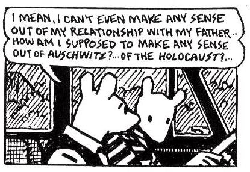
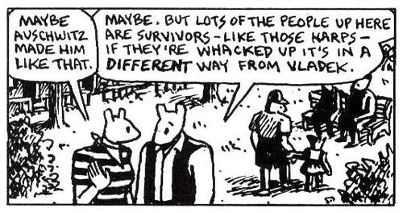

## Reifying memory in Alison Bechdel's *Fun Home*

 * Originally posted at http://acephalous.typepad.com/acephalous/2011/02/alison-bechdel-fun-home-lecture-notes.html
 * Sunday, February 20, 2011

Alison Bechdel's _[Fun Home](http://www.amazon.com/exec/obidos/ASIN/0618871713/diesekoschmar-20)_ fits neatly into the last third of my "[Confessional Narratives](http://acephalous.typepad.com/acephalous/2011/01/confessional-narratives-syllabus.html)" course for all the obvious reasons: it's intensely autobiographical; it's told from an emotional and temporal remove from the events narrated; those events are of indisputable significance to the life of the confessor; etc.  In particular, it resembles Craig Thomspon's _[Blankets](http://www.amazon.com/exec/obidos/ASIN/1891830430/diesekoschmar-20)_ and Art Spiegelman's _[Maus](http://www.amazon.com/exec/obidos/ASIN/0141014083/diesekoschmar-20)_ in that its focus is on the narrator's relationship with someone particular; however, unlike Thompson's relationship with God or Spiegelman's with his father, Vladek, Bechdel's interested in a fundamental reconcilation with her closeted father.  

I'm not claiming that Spiegelman was uninterested in understanding his father better, only that his attempt was doomed to failure because the unknowable horror of the Holocaust made it impossible for him to either share that experience or even understand the gravity of its effects on his father, _e.g._ these non-consecutive panels from "And Here My Troubles Began":  

   

    

There is something non-universal about the way in which the Holocaust altered Vladek Spiegelman, and as much as Art attempts to divine the particular from the universal or vice versa, he never succeeds.  The nightmare of history is such that his father's story can only ever be that: his father's story.  The same doesn't logic doesn't hold for Bechdel's _Fun Home_, not only because the horrors of discovering you're gay aren't comparable to finding yourself in Aushwitz, but because Bechdel's lament is that her father, Bruce, didn't live long enough to experience life outside the closet.  It's no coincidence that Bechdel has "a hallucinogenic memory" of accompanying her closeted father to retreive her mother from the city:

   

The irony of this memory occupying an hallucinogenic space "a few weeks since the Stonewall Riots" in Bechdel's memory should be obvious.  I'm not saying she's lying or even misremembering, only that she's making history meaningful in a way that's similar to what Vladek performed on the first-order and Art did on the second.  The difference between her performance and Art's is that she's doing so in order to make sense of his life in a way Art could never duplicate.  

Again, not faulting anyone for anything here, merely acknowledging what Art himself does above: the inability to understand, however tenuously vicariously, someone else's experience will prevent you from ever sympathizing with or being able to offer anything but sympathy to this other person.  That's not the case in _Fun Home_, which is less concerned with communicating the attempt to reach an inreconciable understanding than the act of coming to an understanding you can live with.

Put in the starkest possible terms: Art fails to understand Vladek because he can't comprehend the Holocaust, whereas Bechdel tries to understand herself through her father's life and succeeds because the attempt is a thing in itself, _e.g._ the book's Proustian returns to Proust:

   

_Fun Home_ reifies memory via narrative, but it does so in a way that reminds readers that human beings aren't made of words.  Granted, the above panel is about as word-specific as word-picture relations come, but in a graphic novel it's panels like this one that are intruding on the conventions of the medium.  People typically think of their memories as feelings and images punctuated by what others said, but outside of graphic novels the only means of communicating them _without recourse to someone else's interpretation of them_is through words.  This difference is figured in the book as the relation between Gatsby in the novel and Redford's portrayal of him onscreen: the former remains closer to Fitzgerald's vision of him because there's no other mind translating, via performance, Gatsby for the audience.

* * *

_People typically think of their memories as feelings and images punctuated by what others said_

???. !.

_Fun Home_ is pretty good, but defective I think in a number of ways. Still, rather than list these as I remember them, I'll let your overreach above echo in the air a bit.

Posted by: Vance Maverick | [Sunday, 20 February 2011 at 09:39 PM](http://acephalous.typepad.com/acephalous/2011/02/alison-bechdel-fun-home-lecture-notes.html?cid=6a00d8341c2df453ef014e5f5ad4c2970c#comment-6a00d8341c2df453ef014e5f5ad4c2970c)

* * *

_???. !._

Don't make me pull out the PET scanners, Vance ... because it'll only depress me more.  No, in terms of memory formation, retention, and recall, emotions and images far outweigh words in terms of the strength of what's remembered.  I don't like that any more than you do.

_Fun Home is pretty good, but defective I think in a number of ways._

Defective how?  I only ask because I'm teaching it again tomorrow and would like a leg up.  Granted, I know the problems I have with it, but they're all typical of the memoir genre and are mitigated by her references to Proust and Joyce, _i.e._ by her demonstrating that she knows the limitations of her own memories, etc.

Posted by: [SEK](http://acephalous.typepad.com) | [Monday, 21 February 2011 at 11:30 AM](http://acephalous.typepad.com/acephalous/2011/02/alison-bechdel-fun-home-lecture-notes.html?cid=6a00d8341c2df453ef014e8639044f970d#comment-6a00d8341c2df453ef014e8639044f970d)

* * *

Two things stick in mind -- the recourse to the dictionary seemed like a desperate grab for coherence; and the drawing of little Alison was consistently more sympathetic than that of the others (giving her more readable expressions). Not that that last is difficult to understand, but it weakened the work.

What got my back up was your claim, not that emotions and images outweigh words, but that I, or any of your listeners, "typically think of" my memories in a certain way. While acknowledging the visual/emotional element is a primary hook, I'd say that the way in which I think of them is narrative.

Posted by: Vance Maverick | [Monday, 21 February 2011 at 04:58 PM](http://acephalous.typepad.com/acephalous/2011/02/alison-bechdel-fun-home-lecture-notes.html?cid=6a00d8341c2df453ef014e863a94d0970d#comment-6a00d8341c2df453ef014e863a94d0970d)

* * *

obvs. s/b "that I or any of your readers 'typically think of' our memories"...

Posted by: Vance Maverick | [Monday, 21 February 2011 at 05:09 PM](http://acephalous.typepad.com/acephalous/2011/02/alison-bechdel-fun-home-lecture-notes.html?cid=6a00d8341c2df453ef014e5f604629970c#comment-6a00d8341c2df453ef014e5f604629970c)

* * *

_Two things stick in mind -- the recourse to the dictionary seemed like a desperate grab for coherence; and the drawing of little Alison was consistently more sympathetic than that of the others (giving her more readable expressions). Not that that last is difficult to understand, but it weakened the work._

It's been a little while since I read it, so I'm not rememebering "the recourse to the dictionary" distinctly, but if it's her looking up "lesbian" in the dictionary, that's a stunningly common element of lesbian coming out stories.  There's almost certainly a large selection bias in terms of who writes down or publicly shares coming out stories, but it comes up a lot.

The second point seems to me the very definition of memoir.  I would be much more suspect if a writer tried to turn themselves into just one more character amongst the others. It's also a question of visual focus matching narrative focus: her father is much more closely observed than her mother is, or than any of the other non-her characters for that matter.

The distinction between Bechdel and Spiegelman to me is that Bechdel sets out to tell her own story and her father's story as a corrolary to her own, whereas Spiegelman sets out to tell his father's story (and his mother's by extension), but finds that he's unable to separate himself and story of his relationship to his father from the effort to understand and present that story.  It's an order of operations thing, but also a difference in whose memories are being presented how. Bechdel is always clear that it's her memories, sometimes partly or wholly reconstructed from artifacts, though her memories also include her investigations of other people's lives and memories. Spiegelman does some of this as well, but the focus is always on his father, and his own life is only introduced as it's relevant to his efforts to learn and understand his father's story.

On memory, Scott, you're using reify wrong, but, like Vance, I also disagree with your characterization of memory.  There's a large literature on this in a number of different disciplines, but notably in anthropology. People have taken on Hayden White's contention that narrativity itself is a modern cultural artifice, to argue instead that while the form or content of narrative will vary from culture to cuture, that narrativity itself is universal and therefor likely hardwired. Even if you experience you own memories as emotionally inflected montage, and this is certainly an element of memory for me, I would argue that people genreally think about them narratively.  I would be very surprised if you told me that you think of your memories as flat moments of personal experience, rather than as located at some point within the sweep of your life and therefor related to proximate events in one way and to a set of overarching narratives in another.

Posted by: JPool | [Monday, 21 February 2011 at 07:59 PM](http://acephalous.typepad.com/acephalous/2011/02/alison-bechdel-fun-home-lecture-notes.html?cid=6a00d8341c2df453ef014e863b4a04970d#comment-6a00d8341c2df453ef014e863b4a04970d)

* * *

_What got my back up was your claim, not that emotions and images outweigh words, but that I, or any of your listeners, "typically think of" my memories in a certain way. While acknowledging the visual/emotional element is a primary hook, I'd say that the way in which I think of them is narrative._

I agree as to what hooks me, but most of the research indicates that readers like us aren't the norm.  I'll pull out sources and such on Wednesday, as this is something I'm obviously invested in.  (Why else read Stein, after all?)

_On memory, Scott, you're using reify wrong, but, like Vance, I also disagree with your characterization of memory._ 

This is an important point, and one I'll return to shortly, but I'm using reify in the most literal sense: her memories are a series of actual, literal connections in her brain, but more importantly, they're connections she turns into a book, which is _res_, a thing, _ipso facto_ etc.  Sorry to be so brief, but must teach tomorrow ...

Posted by: [SEK](http://acephalous.typepad.com) | [Tuesday, 22 February 2011 at 01:44 AM](http://acephalous.typepad.com/acephalous/2011/02/alison-bechdel-fun-home-lecture-notes.html?cid=6a00d8341c2df453ef0147e2bd52fc970b#comment-6a00d8341c2df453ef0147e2bd52fc970b)

* * *

I look forward to your sources and such, Scott. Keep clear, though, the distinction between "how memory works" and "the way we think of memory".

JPool, agreed that memoir is solipsistic practically by definition. In written memoirs, though, the focus can be kept on the author by literary means -- omitting other people, obviously, or writing about them in a way that's openly slanted, perspectival. There are visual means to such ends as well -- and my point is that Bechdel isn't using them, or is using them eccentrically, so that my eye kept being drawn to faces that turned out to be slightly dead. The "contact high" image above is a pretty good exception: the bold figure on the right is not a character, but an intensely felt glimpse from a distance. Too many square inches of Bechdel's frame (I'm claiming) are not alive either in this way or in the different way AB grants herself (as here, goggling).

Posted by: Vance Maverick | [Tuesday, 22 February 2011 at 08:04 AM](http://acephalous.typepad.com/acephalous/2011/02/alison-bechdel-fun-home-lecture-notes.html?cid=6a00d8341c2df453ef014e863df1c5970d#comment-6a00d8341c2df453ef014e863df1c5970d)

* * *

_but I'm using reify in the most literal sense: her memories are a series of actual, literal connections in her brain, but more importantly, they're connections she turns into a book_

OK, that's a completely legit if extremely weird use, but one would have to perform a series of interpretive gymnastic routines to get that from what you wrote, ie "Fun Home reifies memory via narrative,[and by 'narrative' I mean the physical object that contains the written and visual text through which a particular narrative is expressed] ..." 

Aaanyway, Vance has it right here: "Keep clear, though, the distinction between 'how memory works' and 'the way we think of memory'."  Memories are encoded in the brain one way, but unless we're brain damaged (and I suspect Oliver Sacks would have an apropos anecdote here) we don't leave them like that.  Think about what happens when a memory bubbles up and you can't place at first where or when in your life it took place. Assuming that you are anything like me, it drives you nuts! It remains an irritant until you can successfully locate it within narrative or manage to forget it again.

_so that my eye kept being drawn to faces that turned out to be slightly dead._

Vance, that's totally fair. I think part of it is that there's prespective but no real depth of field in _Fun Home_, so your eye isn't directed away from the bits she's not as invested in. I wouldn't have identified that as something that bothered me while reading it, but there definitely was something about the composition that chewed a bit.

Posted by: JPool | [Tuesday, 22 February 2011 at 11:23 AM](http://acephalous.typepad.com/acephalous/2011/02/alison-bechdel-fun-home-lecture-notes.html?cid=6a00d8341c2df453ef014e5f647ce8970c#comment-6a00d8341c2df453ef014e5f647ce8970c)

* * *

"Defective" is too strong -- I should have chosen something with a friendlier valence, like "flawed".

Posted by: Vance Maverick | [Tuesday, 22 February 2011 at 06:27 PM](http://acephalous.typepad.com/acephalous/2011/02/alison-bechdel-fun-home-lecture-notes.html?cid=6a00d8341c2df453ef014e8640a81e970d#comment-6a00d8341c2df453ef014e8640a81e970d)

* * *

JPool: 

_Even if you experience you own memories as emotionally inflected montage, and this is certainly an element of memory for me, I would argue that people generally think about them narratively._

First, there's a difference between the way most people think about memory and the way scholars do.  Keep in mind that people commonly refer to "having" memories, _i.e._ to them being things that can be possessed despite the fact they only exist as unactivated neuronal connections until they're "had."  So, they "have" memories, but once they try to communicate them, they do so through narrative.  Obvious enough.  But most of that understanding of our own lives--those narratives we tell ourselves about ourselves to be ourselves, in the Steinian formulation--isn't tangible in the way Bechdel's is.  She's taking the physical pathways in her head and reifying them into a tangible object you and I can hold in her hands.  (Keeping in mind, of course, that this process is endlessly recursive: thinking about having thought about something changes the physical structure of the memory, etc.)  That's what I meant when I used the word, but I can understand why that wasn't clear.  In other words, when I say it reifies memory via narrative, I mean it's only in the act of narration, in creating the object that is _Fun Home_, I'm pointing to the special status of a graphic novel vs. an ordinary novel when it comes to autobiography. 

Vance:

_the distinction between "how memory works" and "the way we think of memory"._

I think I've mentioned James Olney's [_Memory & Narrative_](http://www.amazon.com/exec/obidos/ASIN/0226628175/diesekoschmar-20) before, but in case not, I will now: it's an engagingly thorough history about how people have thought about memory, and as you can tell from the title, "narrative" is a crucial component to it; however, it's not the only component, as even thinking about the Augustine, for whom memory was a "huge repository," with "secret and unimaginable caverns," that houses "all these things, to be recalled and brought out for use when needed."  Narrative entails movement, but the Augustinian notion is as static as they come.

Posted by: [SEK](http://acephalous.typepad.com) | [Wednesday, 23 February 2011 at 03:33 PM](http://acephalous.typepad.com/acephalous/2011/02/alison-bechdel-fun-home-lecture-notes.html?cid=6a00d8341c2df453ef014e86459976970d#comment-6a00d8341c2df453ef014e86459976970d)

* * *

Thanks for the pointer. Not surprised to hear Augustine treats memory as a repository, almost a "memory palace" (vide Foer, also Matteo Ricci etc.).

Posted by: Vance Maverick | [Wednesday, 23 February 2011 at 09:06 PM](http://acephalous.typepad.com/acephalous/2011/02/alison-bechdel-fun-home-lecture-notes.html?cid=6a00d8341c2df453ef014e8647267f970d#comment-6a00d8341c2df453ef014e8647267f970d)

* * *

_I'm pointing to the special status of a graphic novel vs. an ordinary novel when it comes to autobiography._

This is where you lose me. I don't really care about "reify" and I suspect with time it will mean something quite different than what it originally did, but I  don't see how the addition of pictures makes a graphic novel more of an object (or more fixed, or whatever you meant) than a regular old texty book.

This:  

_there's a difference between the way most people think about memory and the way scholars do._  

is obnoxious (duh; which scholars; what aspects of memory; etc), but I won't belabor the issue.

With Augustine you're getting into the (English language; I don't know how it works in Latin) slippage between memory and memories. "Memory", the faculty, includes all of those things that we (think) we remember: facts, impressions, associations, as well as events or personal experiences. "Memories", by contrast, is used almost exclusively for personal, episodic recollections.  These are stored and re-stored in the brain as episodes, but we access and make sense of them through narrative.

Posted by: JPool | [Thursday, 24 February 2011 at 09:14 PM](http://acephalous.typepad.com/acephalous/2011/02/alison-bechdel-fun-home-lecture-notes.html?cid=6a00d8341c2df453ef014e5f72c334970c#comment-6a00d8341c2df453ef014e5f72c334970c)

* * *

I have to say, I enjoy reading your blog. Maybe you could let me know how I can subscribing with it ? I feel I should let you know I found your page through yahoo.   

Posted by: [herve leger](http://www.hervelegercp.com) | [Friday, 23 March 2012 at 03:37 AM](http://acephalous.typepad.com/acephalous/2011/02/alison-bechdel-fun-home-lecture-notes.html?cid=6a00d8341c2df453ef0167642154cd970b#comment-6a00d8341c2df453ef0167642154cd970b)
        
