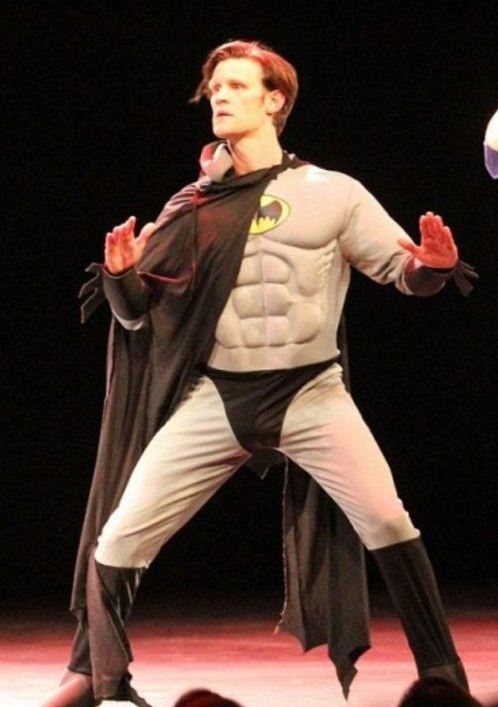

## This must be the world's way of telling me it's time to rejoin it.

 * Originally posted at http://acephalous.typepad.com/acephalous/2011/06/this-must-be-the-worlds-way-of-telling-me-its-time-to-rejoin-it.html
 * Thursday, June 23, 2011

They made this just for me, [put it on in Los Angeles](http://www.comicsalliance.com/2011/06/21/doctor-who-batman-matt-smith/) and everything, yet somehow I missed it:

   
Via [Scott McCloud](http://scottmccloud.com/2011/06/23/i-am-the-butterfly-wing-that-caused-the-hurricane-that-tried-to-blow-over-matt-smith/). 

That's right: _**The Doctor** as **Batman** via **Scott McCloud**_. 

And _I missed it_. 

* * *

Now there's one confusing regeneration.  Maybe it's the kind of thing that happens to Time Lords as they approach their 12th.  The Master might make a good Dr. Doom.

Posted by: [Rich Puchalsky](http://rpuchalsky.blogspot.com) | [Thursday, 23 June 2011 at 02:18 PM](http://acephalous.typepad.com/acephalous/2011/06/this-must-be-the-worlds-way-of-telling-me-its-time-to-rejoin-it.html?cid=6a00d8341c2df453ef0154333601fd970c#comment-6a00d8341c2df453ef0154333601fd970c)

* * *

If the Eleventh regenerated into Bruce Wayne, I'd be in a kind of Nerd Heaven that I never thought imaginable.  

There's actually a larger issue here, at least with me, because I've frequently thought that if you let Wayne become 900 years old, he'd essentially become the Doctor: no special powers, per se; a love of toys; a joy taken in outwitting opponents; etc.  The only difference is that the Batman fights, but like the Doctor, abjures the use of guns ... but over time, and with a proliferation of toys, I think the Batman might renounce kicking just as strongly as shooting.

(It's summer, I'm burnt to a crisp, and am allowed this little bit of Nerd Heaven, I do believe.)

Posted by: [SEK](http://acephalous.typepad.com) | [Thursday, 23 June 2011 at 02:25 PM](http://acephalous.typepad.com/acephalous/2011/06/this-must-be-the-worlds-way-of-telling-me-its-time-to-rejoin-it.html?cid=6a00d8341c2df453ef01538f62c09d970b#comment-6a00d8341c2df453ef01538f62c09d970b)

* * *

_There's actually a larger issue here, at least with me, because **I've frequently thought** that if you let Wayne become 900 years old, he'd essentially become the Doctor:_

Okay, if you have frequently thought this, even [comic book guy](http://en.wikipedia.org/wiki/Comic_Book_Guy) would be entitled to think you need to get out more.

Posted by: Malaclypse | [Friday, 24 June 2011 at 10:51 AM](http://acephalous.typepad.com/acephalous/2011/06/this-must-be-the-worlds-way-of-telling-me-its-time-to-rejoin-it.html?cid=6a00d8341c2df453ef01538f6826cb970b#comment-6a00d8341c2df453ef01538f6826cb970b)

* * *

Unfortunately, with a two-hour commute, your choices are limited to 1) actually re-listening to the second hour of _All Things Considered_ or 2) noodling on in your own head about material you're writing book chapters on.  I take it you can see what route I sometimes take.

Posted by: [SEK](http://acephalous.typepad.com/) | [Saturday, 25 June 2011 at 12:36 PM](http://acephalous.typepad.com/acephalous/2011/06/this-must-be-the-worlds-way-of-telling-me-its-time-to-rejoin-it.html?cid=6a00d8341c2df453ef01538f6e7646970b#comment-6a00d8341c2df453ef01538f6e7646970b)

