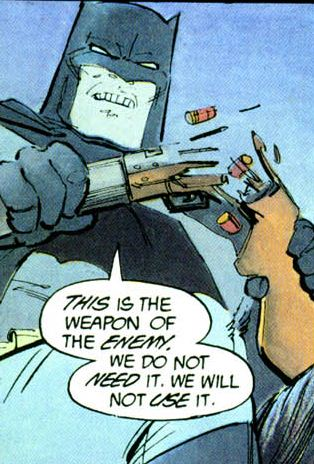

## You know who wouldn’t mind watching a film in a gun-free zone?

 * Originally posted at http://acephalous.typepad.com/acephalous/2012/07/you-know-who-wouldnt-mind-watching-a-film-in-a-gun-free-zone.html
 * Sunday, July 22, 2012

This guy:

Because he also [saw something terrible happen at a theater](http://acephalous.typepad.com/acephalous/2011/04/how-do-you-make-a-batman.html).  The only person who thinks that guy would support filling the air of a  crowded theater with crossfire would be a good idea would be [the one who drew him](http://acephalous.typepad.com/acephalous/2011/10/holy-terror-frank-miller-my-how-far-youve-fallen.html).

* * *

'Course, 108 pages earlier, Batman straight-up shoots a Mutant, point-blank, in the face with a machine gun.

Posted by: [Finenessandaccuracy.wordpress.com](http://profile.typepad.com/finenessandaccuracywordpresscom) | [Sunday, 22 July 2012 at 08:12 PM](http://acephalous.typepad.com/acephalous/2012/07/you-know-who-wouldnt-mind-watching-a-film-in-a-gun-free-zone.html?cid=6a00d8341c2df453ef017616a2f73b970c#comment-6a00d8341c2df453ef017616a2f73b970c)

* * *

"Rubber bullets. Honest."

Posted by: Craigo | [Sunday, 22 July 2012 at 08:30 PM](http://acephalous.typepad.com/acephalous/2012/07/you-know-who-wouldnt-mind-watching-a-film-in-a-gun-free-zone.html?cid=6a00d8341c2df453ef017616a305c5970c#comment-6a00d8341c2df453ef017616a305c5970c)

* * *

_Batman straight-up shoots a Mutant, point-blank, in the face with a machine gun._

Old Batman, who was holding a child and had no other way to defend himself. That's different, damn it.

Posted by: [SEK](http://acephalous.typepad.com/) | [Sunday, 22 July 2012 at 08:31 PM](http://acephalous.typepad.com/acephalous/2012/07/you-know-who-wouldnt-mind-watching-a-film-in-a-gun-free-zone.html?cid=6a00d8341c2df453ef017616a306ad970c#comment-6a00d8341c2df453ef017616a306ad970c)

* * *

Technically, the Mutant was holding the child (and holding a gun to said child's head), but I don't think Batman gets any less old as the book progresses...

Posted by: [Finenessandaccuracy.wordpress.com](http://profile.typepad.com/finenessandaccuracywordpresscom) | [Sunday, 22 July 2012 at 09:07 PM](http://acephalous.typepad.com/acephalous/2012/07/you-know-who-wouldnt-mind-watching-a-film-in-a-gun-free-zone.html?cid=6a00d8341c2df453ef017616a328a5970c#comment-6a00d8341c2df453ef017616a328a5970c)

* * *

Scott: I was employing the very compelling argument "Yeah, well, _because_." Please don't deign to dignify me with a response.

Posted by: [SEK](http://acephalous.typepad.com/) | [Sunday, 22 July 2012 at 09:09 PM](http://acephalous.typepad.com/acephalous/2012/07/you-know-who-wouldnt-mind-watching-a-film-in-a-gun-free-zone.html?cid=6a00d8341c2df453ef0177438957e0970d#comment-6a00d8341c2df453ef0177438957e0970d)

* * *

Beg your pardon, sir, you are of course in the right. Consider my quibble withdrawn!

Posted by: [Finenessandaccuracy.wordpress.com](http://profile.typepad.com/finenessandaccuracywordpresscom) | [Sunday, 22 July 2012 at 09:17 PM](http://acephalous.typepad.com/acephalous/2012/07/you-know-who-wouldnt-mind-watching-a-film-in-a-gun-free-zone.html?cid=6a00d8341c2df453ef017616a33374970c#comment-6a00d8341c2df453ef017616a33374970c)

