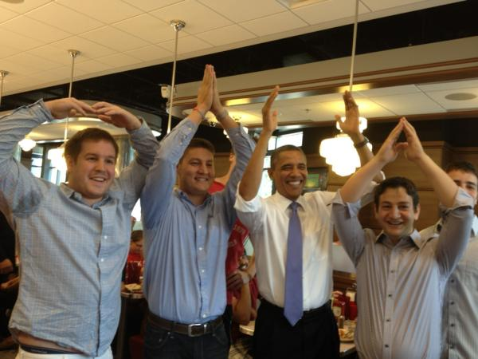

## Obama's "Dan Quayle moment"

 * Originally posted at http://acephalous.typepad.com/acephalous/2012/08/obamas-dan-quayle-moment.html
 * Wednesday, August 22, 2012

Surprise! It never happened. But I'm not opposed to [conservatives](http://twitchy.com/2012/08/22/barack-obamas-dan-quayle-moment/) [claiming it did](http://minx.cc/?post=332131), if only because it makes my life [even easier than it already was](http://www.lawyersgunsmoneyblog.com/2012/08/dear-the-media). Here's the allegedly damning image:

Conservatives look at this and salivate: "The President misspelled 'Ohio'! That's worse than misspelling 'potato' because 'potato' ain't a state!" At the second link above—which I can't recommend clicking on, because that's what you have me for—the comments are largely anticipatory about how the mainstream media will spin this. One person heads off the excuse that the image has been reversed because in an image taken moments later, Obama's watch is still on his left arm. Another cracks wise about how Arabic is written from right-to-left and what we all know about Obama's real religious affiliation. But not a single one of them points out the blindingly obvious fact that _the people in the picture are facing the camera_.  Which means that their left is the photographer's right. So from their perspective they're spelling "O-H-I-O," which as many of you know is the proper spelling of "Ohio."

Not that there isn't a legitimate complaint to be made: I'm not sure I'm entirely comfortable with a Leader of the Free World not knowing how to spell out words via a human chain. What if that 3 a.m. phone call is from the Village People in 1978?

An entire generation might be left wandering dark streets and darker alleys in a vain search for the ACMY.

* * *

You know, if you just flip the photo, you can't tell.  Only the most nit-picky of people will look at the massively blurry numbers on the red shirt behind Obama and notice the flip.  

Posted by: james suhr | [Wednesday, 22 August 2012 at 06:17 PM](http://acephalous.typepad.com/acephalous/2012/08/obamas-dan-quayle-moment.html?cid=6a00d8341c2df453ef01761762cec0970c#comment-6a00d8341c2df453ef01761762cec0970c)

* * *

I didn't even think to check the text in the image. I don't think it matters if it's flipped or not -- except it's more pathetic on the part of conservatives if it is. To the Kerning Mobile!

Posted by: [SEK](http://acephalous.typepad.com/) | [Wednesday, 22 August 2012 at 06:34 PM](http://acephalous.typepad.com/acephalous/2012/08/obamas-dan-quayle-moment.html?cid=6a00d8341c2df453ef01761762db0c970c#comment-6a00d8341c2df453ef01761762db0c970c)

