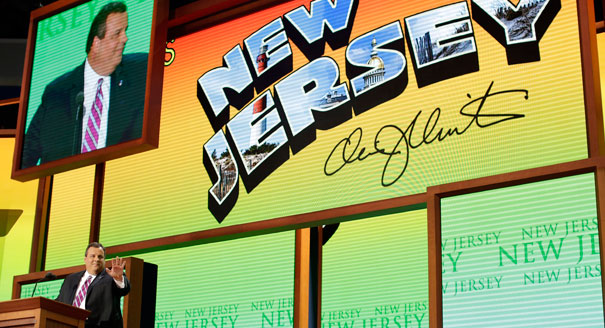
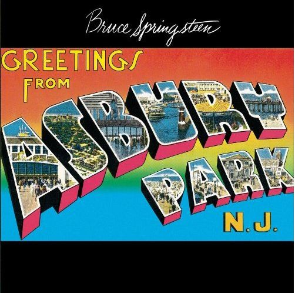

## Yes, Governor Christie, I'm sure *this* will impress him.

 * Originally posted at http://acephalous.typepad.com/acephalous/2012/08/yes-governor-christie-im-sure-this-will-impress-him.html
 * Wednesday, August 29, 2012

You have to feel for Chris Christie. The biggest political speech of his life and he backdrops himself thus:

If that looks familiar, that's because if you have anything resembling taste it damn well should:

Christie loves him some Springsteen. Grew up listening to and idolizing the Bard of the Badlands. [The feeling's mutual](http://www.theatlantic.com/magazine/archive/2012/07/jersey-boys/309019/):

> Despite heroic efforts by Christie, Springsteen, who is still a New  Jersey resident, will not talk to him. They’ve met twice—once on an  airplane in 1999, and then at the 2010 ceremony inducting Danny DeVito  into the New Jersey Hall of Fame, where they exchanged only formal  pleasantries. (Christie does say that Springsteen was very kind to his  children.) At concerts, even concerts in club-size venues—the Stone  Pony, in Asbury Park, most recently—Springsteen won’t acknowledge the  governor. When Christie leaves a Springsteen concert in a large arena,  his state troopers move him to his motorcade through loading docks. He  walks within feet of the stage, and of the dressing rooms. He’s never  been invited to say hello. On occasion, he’ll make a public plea to  Springsteen, as he did earlier this spring, when Christie asked him to  play at a new casino in Atlantic City. “He says he’s for the  revitalization of the Jersey Shore, so this seems obvious,” Christie  told me. I asked him if he’s received a response to his request. “No, we  got nothing back from them,” he said unhappily, “not even a ‘Fuck  you.’”

Did I write "mutual"? I meant _the opposite_ of mutual. You have to wonder about someone who embraces a musician this deeply without listening to a damn thing he sings. The disconnect between lyric and listener is borderline sociopathic: if you spend your nights ears-deep in working-class tales of toil and despair and your days enacting policies that guarantee a future full of working-class tales of toil and despair, people may begin to suspect that you've embraced some strange form of patronage-by-poverty. They may begin to think that you're trying to manufacture the social conditions necessary to create a newer, "better" Springsteen whose "convictions" won't interfere with yours because you'll have whispered the Gospel of the Free Market in his ear from the moment you turned him into a foundling. Not that you murdered his parents, mind you, they're just not in his life anymore. And then years later, when you successfully run for President, you and your pet Springsteen will tour the country and your rallies will begin with your pet's new hit, "Burn Down the U.S.A.," a rousing tune about the virtues 
of small government.

People may begin to consider that you indulge in this pathetic fantasy because you're as small of mind as you are large of body, and the man whose approval you so desperately seek won't even begrudge you a "Fuck you."

**JUST IN CASE SOMETHING OR OTHER ([WITH PRETTY DAMNING LYRICS](http://www.springsteenlyrics.com/lyrics/l/lostintheflood.php)):**

[Youtube video](https://youtu.be/jjvS01H1Rxw)
		
* * *

"Won't even begrudge you a 'Fuck You?'"  I think the problem is precisely that Springsteen does, in fact, begrudge Christie even the respect of a "Fuck You."

I, on the other hand, have no such compunctions -- so fuck you, Chris Christie.

Posted by: newsouthzach | [Wednesday, 29 August 2012 at 06:46 AM](http://acephalous.typepad.com/acephalous/2012/08/yes-governor-christie-im-sure-this-will-impress-him.html?cid=6a00d8341c2df453ef017c3188bcb5970b#comment-6a00d8341c2df453ef017c3188bcb5970b)

* * *

Not sure what's more disconsonant, this or Paul Ryan claiming his favorite band is Rage Against the Machine. I wonder if Ryan knows Tom Morello has been protesting his ass and Scott Walker all year at the Wisconsin state capitol building. 

But there's always the 1984 election; Reagan beat Christie to pop music cognitive dissonance re: Bruce Springsteen.

Posted by: mxyzptlk | [Wednesday, 29 August 2012 at 09:01 AM](http://acephalous.typepad.com/acephalous/2012/08/yes-governor-christie-im-sure-this-will-impress-him.html?cid=6a00d8341c2df453ef017c31892d40970b#comment-6a00d8341c2df453ef017c31892d40970b)

* * *

I was wondering why he would use such a bizarre (at least in the context of the Amero-fascist consistency of everything else) color scheme. Still doesn't explain the swirling clouds behind him during the speech that made it look like our medications were wearing off....

Posted by: [Ahistoricality](http://ahistoricality.blogspot.com) | [Wednesday, 29 August 2012 at 11:30 AM](http://acephalous.typepad.com/acephalous/2012/08/yes-governor-christie-im-sure-this-will-impress-him.html?cid=6a00d8341c2df453ef0177446751e6970d#comment-6a00d8341c2df453ef0177446751e6970d)

* * *

I'm sure you listened to the speech with an open mind.  

So...is there a political litmus test for appreciating the work of an artist? Liberals can only listen to liberal musical artists and vice versa? Seems pretty small minded. I can appreciate the talent and creativity of an artist without having to know his/her political leanings....can you?

Posted by: jeff kaufman | [Wednesday, 29 August 2012 at 06:54 PM](http://acephalous.typepad.com/acephalous/2012/08/yes-governor-christie-im-sure-this-will-impress-him.html?cid=6a00d8341c2df453ef017c318b19fd970b#comment-6a00d8341c2df453ef017c318b19fd970b)

* * *

So Jeff, you wouldn't find any inconsistency if Cory Booker used Ted Nugent at the Democratic National Convention, or if Joe Biden walked out to Hank Williams Jr.?

The argument isn't about small-mindedness or the ability to appreciate a song, it's about the political recruitment of cultural work the content of which argues against the political positions for which they're being recruited to support. Sort of like if the NSA sent out complimentary copies of 1984 to all Americans to help roll out the USA PATRIOT act. Sure, it's a beloved piece of literature, but you'd have to be pretty tone-deaf not to recognize that 1984 doesn't celebrate a surveillance state. 

And that's the point: When so many other people recognize the cognitive dissonance of Christie putting forward that particular piece of cultural work, they begin to ask questions: Is he that really that tone-deaf, or is he just that cynical? If he's that tone-deaf, what does that say about his attention to detail when it comes to policy matters if he can't even parse a pop song?   If he's that cynical, is that worse than being tone-deaf? Either way, is that someone you want as a leader -- someone who either can't get past the chorus and the riff, or someone who thinks _you_ can't?

Don't forget a prime motivator for this blog is the relationship between form and content in cultural work. The form here -- recruiting the bard of the working class -- doesn't work with the content of Christie's policies or rhetoric.

Posted by: mxyzptlk | [Thursday, 30 August 2012 at 01:19 PM](http://acephalous.typepad.com/acephalous/2012/08/yes-governor-christie-im-sure-this-will-impress-him.html?cid=6a00d8341c2df453ef01761785e440970c#comment-6a00d8341c2df453ef01761785e440970c)

* * *

_Is he that really that tone-deaf,_ 

"'You know, politicians they only hear the chorus, they never hear the verse.' But [the thing is](http://www.youtube.com/watch?v=4D-p-DbsTp8), the verse is the story and the verse is the message."

(I really like that introduction and, a propos of this blogs interest in visual iconography I do find the contrast between Gretchen Peters and everybody who's dressed up for the fundraiser really interesting.

Posted by: [NickS](http://www.beforeyoulisten.com) | [Friday, 31 August 2012 at 11:26 AM](http://acephalous.typepad.com/acephalous/2012/08/yes-governor-christie-im-sure-this-will-impress-him.html?cid=6a00d8341c2df453ef0176178a1aed970c#comment-6a00d8341c2df453ef0176178a1aed970c)

* * *

OK, MXYZPTLK...that does it. When you go back to the fifth dimension you are banned from watching any Clint Eastwood movies......oh, yes....and then there's a fifteen minute time out in the empty chair

Posted by: jeff kaufman | [Monday, 03 September 2012 at 08:46 AM](http://acephalous.typepad.com/acephalous/2012/08/yes-governor-christie-im-sure-this-will-impress-him.html?cid=6a00d8341c2df453ef017d3bce5c04970c#comment-6a00d8341c2df453ef017d3bce5c04970c)

