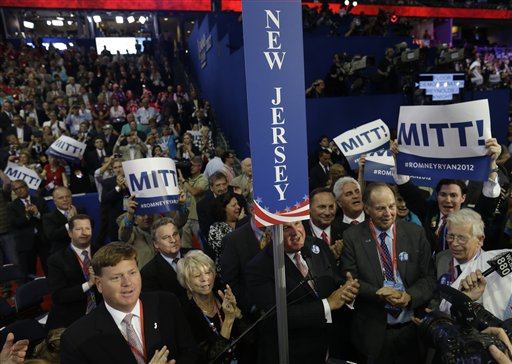
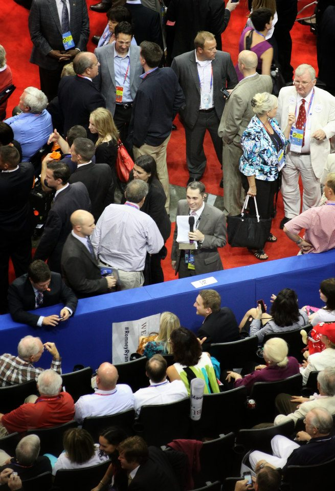
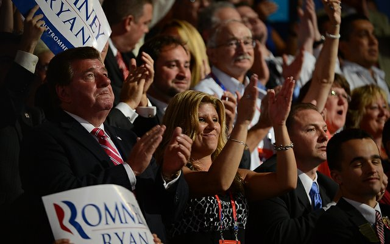
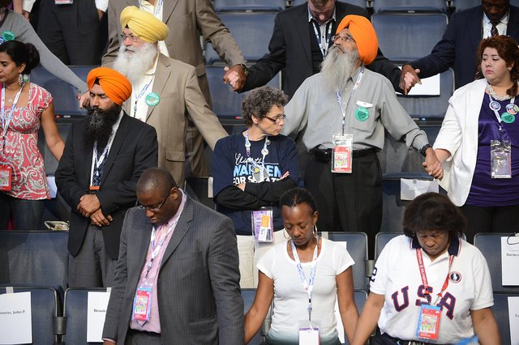
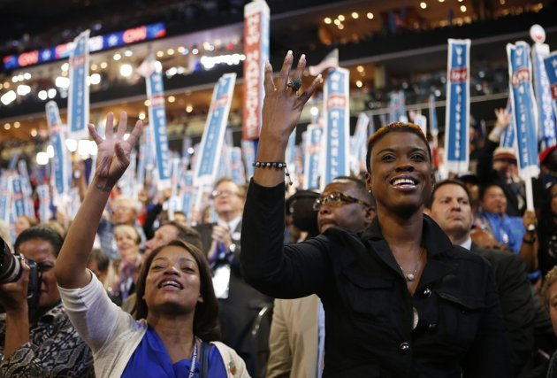

## Does the existence of conservative “individuals of color holistically demolish the Left’s paranoid, feverish, and disgusting fantasy that white Republicans speak with white bigots through some tribal Caucasian dialect[?]“

 * Originally posted at http://acephalous.typepad.com/acephalous/2012/09/does-the-existence-of-conservative-individuals-of-color-holistically-demolish-the-lefts-paranoid-fev.html
 * Thursday, September 06, 2012

No. You don’t need to be a white Republican to appeal to white Republicans: you merely need to tailor your rhetoric so that it appeals to white Republicans. Doesn’t matter what color you are. It’s not about the person on the stage: it’s about the audience that person’s appealing to. Meaning Deroy Murdock’s [entire post](http://www.nationalreview.com/corner/316052/rnc-speakers-undermined-racist-code-deroy-murdock) is beside any and all points:

> If Republican operatives truly  are brilliant enough to use secret code to convince white bigots to  pull the elephant lever in November, they should have been smart enough  to control the podium at their convention in Tampa, Fla. As a black man,  the Republicans’ racial code never penetrated my ears. However, my eyes  worked just fine. And what I repeatedly saw were minority faces on my  TV.
> 
> The racist dog whistles must have gone silent even for Labradors when a black woman and former secretary of state named Condoleezza Rice  addressed the convention for nearly half an hour in prime time Wednesday night, just before vice-presidential nominee Paul Ryan gave his  acceptance speech, arguably Tampa’s finest. Similarly, and also in prime time, a Hispanic senator named Marco Rubio (R., Fla) introduced the  Republican party’s presidential standard bearer, Mitt Romney, while 30 million people tuned in …
> 
> And Rice and Rubio were far from alone. Black Republicans such as  Representative Tim Scott of South Carolina; Saratoga Springs, Utah,  mayor and congressional nominee Mia Love, and former Alabama  representative Artur Davis (an ex-Democrat) all addressed the convention and were televised, at least on C-SPAN. Leading Hispanic Republican  speakers included Texas Senate nominee Ted Cruz, Puerto Rico governor  Luis Fortuño, New Mexico governor Susana Martinez, and Nevada governor  Brian Sandoval. South Carolina Governor Nikki Haley also wowed the  crowd. She is an American of Indian descent, another ascendant minority group.
> 
> These amplified, televised, and _loudly applauded_ individuals of color holistically demolish the Left’s paranoid, feverish, and disgusting fantasy that white Republicans speak with white bigots through some tribal Caucasian dialect.

His argument amounts to “Because people of color were on the stage the rhetoric couldn’t be designed to appeal to white people.” Except Murdock and his italics prove that argument wrong: if these people of color were “_loudly applauded_” then whatever rhetoric they used was effective on their audience. This is Rhetoric 101: all rhetorical appeals are effective on a given audience in a particular historical situation. It’s called “[the rhetorical situation](http://www.lawyersgunsmoneyblog.com/2011/01/what-is-violent-rhetoric)” and Murdock’s defined the Republican National Convention as one in which a person of color living in 2012 could muster up a message that appeals to a Republican audience. What does their audience look like?  According to FOX News and the _Washington Times_ it looked like this:

All Murdock has proven is that people of color can effectively appeal to almost exclusively white audiences. There’s no logic to the claim that white Republicans can’t be racist because they approve of speech designed to pander to them. The more important point isn’t that white Republicans are racist but that the majority of Republicans are white.  Why? Because that means the majority of rhetorical appeals made by Republican candidates to Republican audiences will be constructed to appeal to white people and white interests. When [Sarah Palin posted images of herself with her supporters](http://www.lawyersgunsmoneyblog.com/2009/11/you-only-noticed-im-white-because-youre-a-racist) in 2009 I noted that they were self-selected. Palin’s people knew their audience and produced a visual spread that would appeal to it. The Republicans are in a similar situation: so long as their audience remains overwhelmingly white their most effective rhetoric must appeal to an overwhelmingly white audience. It doesn’t matter what color the person on the stage is. What matters is the diversity of the people—and therefore the diversity of interests—that the person on stage addresses. Speaking of which:

Those are also from the _Washington Times_ and demonstrate exactly why the Democratic Party must embrace diversity instead of [settling for tokenism](http://www.lawyersgunsmoneyblog.com/2010/04/the-tea-partys-love-affair-with-tokenism): in order to effectively appeal to this audience a speaker must consider a range of disparate interests and find a way to address all without denigrating any.

\[_This has been another installment in [material so obvious](http://www.lawyersgunsmoneyblog.com/2012/08/dear-the-media) [I feel dumber](http://www.lawyersgunsmoneyblog.com/2012/09/why-is-mentioning-food-stamps-or-chicago-a-racist-dog-whistle-because-conservatives-made-it-one) for having to address it._\]

* * *

I wonder if the non sequitur is deliberate, or if he really believes that tokenism disproves racism?

Let's face it: the attempt to appeal to minorities is, in fact, _why_ racist attacks are coded. The point is to be racist without losing the support of minorities who think you might be useful, or who have otherwise internalized their oppression.

Posted by: [Ahistoricality](http://ahistoricality.blogspot.com) | [Thursday, 06 September 2012 at 03:07 PM](http://acephalous.typepad.com/acephalous/2012/09/does-the-existence-of-conservative-individuals-of-color-holistically-demolish-the-lefts-paranoid-fev.html?cid=6a00d8341c2df453ef017c31b0cc1d970b#comment-6a00d8341c2df453ef017c31b0cc1d970b) 

* * *

_the attempt to appeal to minorities is, in fact, why racist attacks are coded. The point is to be racist without losing the support of minorities who think you might be useful, or who have otherwise internalized their oppression._

Couldn't have said it better myself.

Posted by: [SEK](http://acephalous.typepad.com/) | [Thursday, 06 September 2012 at 03:16 PM](http://acephalous.typepad.com/acephalous/2012/09/does-the-existence-of-conservative-individuals-of-color-holistically-demolish-the-lefts-paranoid-fev.html?cid=6a00d8341c2df453ef017c31b0d44e970b#comment-6a00d8341c2df453ef017c31b0d44e970b)

