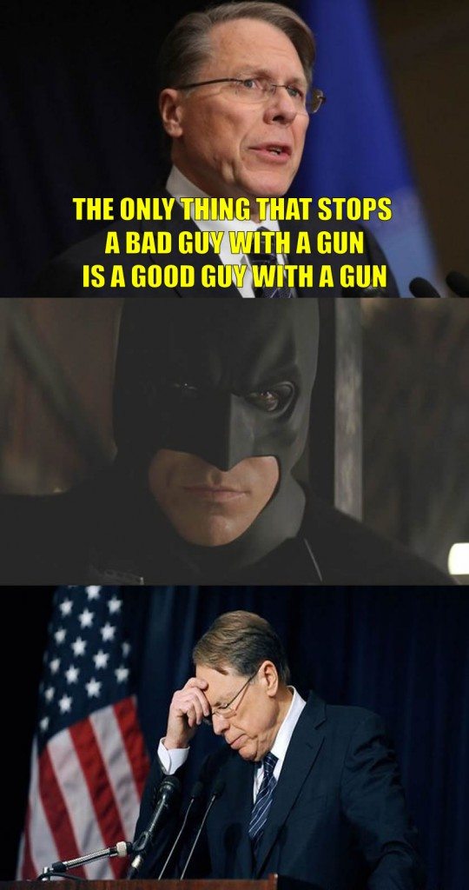

## As long as the "conversation" about guns concerns hypotheticals about fictions ...

 * Originally posted at http://acephalous.typepad.com/acephalous/2012/12/as-long-as-the-conversation-about-guns-concerns-hypotheticals-about-fictions-.html
 * Monday, December 31, 2012

... I don't see the harm in adding more fictions to the hypotheticals. Given that the opposition's evidence is the "millions" of home-invasions that've been thwarted yearly, or most probably even hourly, by gun-savvy Common People Who Love The Constitution More Than Dirty Liberals Do, I don't see why Dirty Liberals oughta restrict themselves to reality. And so:

Q.E.D.

* * *

There are other genre narratives that fit that model: Kung Fu and McGyver come to mind. 

The real problem with that statement isn't the Batman issue, but the "good guys with guns kill people by accident _all the time_" and more guns just exacerbates the problem. 

Posted by: [Ahistoricality](http://ahistoricality.blogspot.com) | [Tuesday, 01 January 2013 at 02:25 PM](http://acephalous.typepad.com/acephalous/2012/12/as-long-as-the-conversation-about-guns-concerns-hypotheticals-about-fictions-.html?cid=6a00d8341c2df453ef017c3534c3e5970b#comment-6a00d8341c2df453ef017c3534c3e5970b)

* * *

Doesn't it say something about our culture, though, that "action hero who eschews firearms" is a substantial category, with clear subgenres ("retired action hero who has to take up gun again" being the most obvious). 

Posted by: [Ahistoricality](http://ahistoricality.blogspot.com) | [Friday, 04 January 2013 at 09:22 PM](http://acephalous.typepad.com/acephalous/2012/12/as-long-as-the-conversation-about-guns-concerns-hypotheticals-about-fictions-.html?cid=6a00d8341c2df453ef017c3552138f970b#comment-6a00d8341c2df453ef017c3552138f970b)

