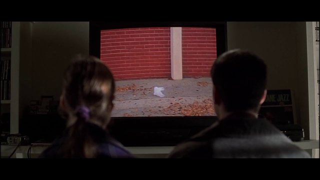
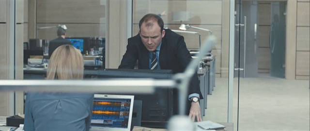
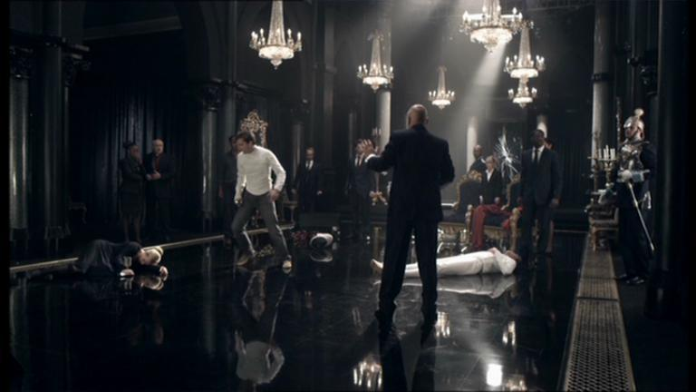
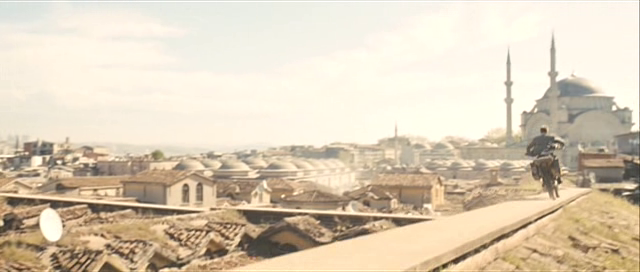
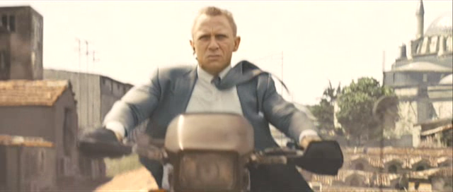
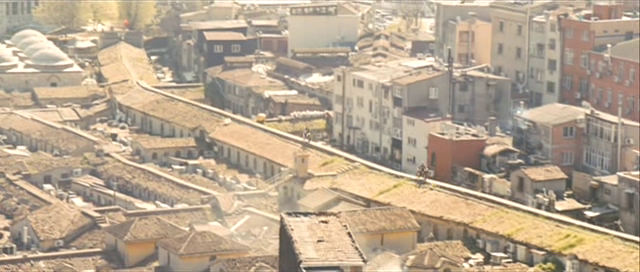
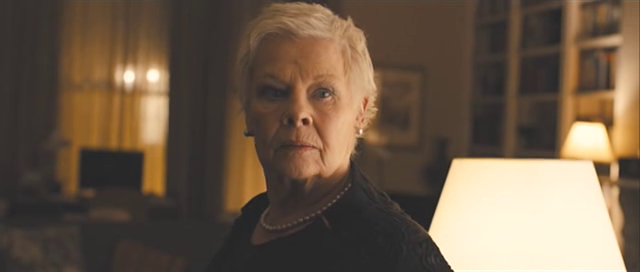
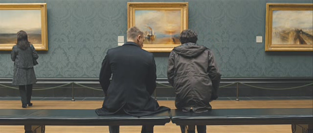
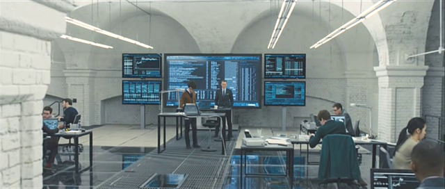
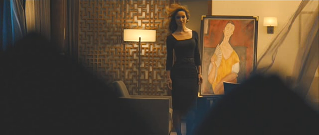

## Poor *Skyfall*, it deserved better

 * Originally posted at http://acephalous.typepad.com/acephalous/2013/02/poor-skyfall-it-deserved-better.html
 * Sunday, February 24, 2013

Sam Mendes is the Don Delillo of contemporary cinema, in that he’s as beloved as he’s banal and otherwise right-thinking people seem incapable of recognizing him as such. A few years ago [I wrote of my hatred of the flat affect (or affected flatness) that characterizes Delillo’s prose](http://acephalous.typepad.com/acephalous/2005/10/don_delillo_pil.html), and I’m going to be making a similar argument about Mendes. I can make that argument directly, in that both blame the postmodern condition for the flattening and both think that finding meaning in meaninglessness is the proper aesthetic response to it. To wit:

> To understand all this. To penetrate this secret. The mountain was here, unconcealed, but no one saw it or thought about it, no one knew it existed except the engineers … a unique cultural deposit … and he saw himself for the first time as a member of an esoteric order, they were adepts and seers, crafting the future, the city planners, the waste managers, the compost technicians, the landscapers who would build hanging gardens here, make a park one day out of every kind of used and eroded object of desire.

To understand Delillo. To penetrate his secret. The appeal is there, everyone sees it when they think about it, everyone knows it is “a unique cultural deposit,” taken by Delillo on the chest of Americans who want to believe they belong to an esoteric order, that they are the adepts and seers of literature. Only they aren’t. They read a big book full of moments, as above, in which characters look at “garbage” and are struck by an epiphanic bolt named “recycling.” Don Delillo writes “deep” thoughts for stupid people. Mendes traffics in similar crap:

I don’t care if it could be mistaken for a two-shot of people in a museum, that thing they’re looking at is still a plastic bag, not a reminder that everything is connected. Or if it is a reminder that everything’s connected we’re back to the profundity that it is modern recycling. It’s not evidence that there’s “this entire life behind things, and this incredibly benevolent force  that wanted me to know that there was no reason to be afraid.” It’s not an ontological proof of the existence of a non-denominational Kindness that communicates through gusts of trash. _It’s a fucking plastic bag_. But it gets worse. It’s a plastic bag “that was just, dancing with [Ricky], like a little kid begging [for him] to play with it—for fifteen minutes,” meaning that it’s a plastic bag that Ricky didn’t recycle. He befriended it in the name of the non-denominational Kindness who speaks through trash and filmed the encounter so we all could meet said Kindness through Art. It’s first-order Art in the film, when Ricky shows it to Jane, but it’s second-order Art when Mendes presents us Ricky showing it to Jane, so we experience their experience of Art because in the postmodern world one can never experience The Thing Itself only mediated versions of It through Art. This is a Baudrillard-bruised insight from ’70s masquerading as profundity and everyone fell for it.  The Academy declared it the Most Unique Cultural Deposit of 1999 and 
Mendes the Most Unique Cultural Depositor of the same.

Which brings us to _Skyfall_. I watched it last night and thought it a fine little Bond film. But it was not the Art it thought it was. Mendes comes from a theatrical background and directs his movies like old episodes of _Masterpiece Theater_: he positions the camera at some distance from the action, checks that every element of the frame is in focus, then walks away. The result is a reliance on shots that are longer than they need to be:

He seems not to know that when every element of a shot is in focus, the result is a flatter looking shot. There is foreground only in the literal sense that some people are closer to the camera, but because the people in the background as are crisp those in the foreground, the frame feels short and flat, like someone learned how to stage a scene in a theater. Just so you don’t think I’m unfairly knocking filmed versions of theatrical productions, here is a screen capture [from something you know I’m inclined to love](http://acephalous.typepad.com/acephalous/doctor-who/):

[The Doctor and Captain Picard in _Hamlet_](http://www.pbs.org/wnet/gperf/episodes/hamlet/watch-the-film/980/).  Brilliant! Marvel at the spectacular set design! Glory in the deftly composed theatrical lighting! Are you done yet? Good. Now look at the shot itself: the spectacular acting and stunning design and artful lighting are all undermined by the manner in which they appear on film.  That’s not a criticism, just an acknowledgment of difference. Plays must be filmed at this scale (an extreme long shot here)  because the alternative is that the performance is halted every time an in-frame element or the camera needed adjusting. In which case the play would cease being a play and become a movie. Saying that Tennant and Stewart’s _Hamlet_ looks like a play isn’t an insult_,_ merely an acknowledgment of what it is. But _Skyfall_ is not a play. It’s a film too often shot like one. Even the action scenes: 

That’s an establishing shot, so I can forgive Mendes its scale and depth because he needs to indicate the important elements of the scene.  Now that we know where the Bond element is in relation to the others we’ll probably cut to a close-up:

The close-up allows the audience to see both the mental focus and physical toll that this chase is having on the Bond element. The establishing shot informs us where he is and the close-up tells us how he’s coping with the chase. Where to next?

A re-establishing shot that’s more extreme than the initial one? The charitable reading of this decision would be that Mendes wants to communicate the confusion rooftop-motorbiking necessarily entails, but such a reading would be pre-undermined by the close-up he just cut from, in which Bond looks like he’s facing down danger with the unperturbed cool with which Bonds face down dangers. The decision to increase the scale from extreme-long to extreme-longer combined with the one to keep the entire frame in focus results in flat shot in which no elements—not even the Bond one—are afforded more significance than any other. Just as the audience of the Tennant _Hamlet know_ they should be paying more attention to Tennant as Hamlet, the audience of _Skyfall knows_ that Bond is most important element in that frame. But thanks to Mendes they can’t _see_ him well enough to care.  

Someone seems to have informed Mendes that his propensity for deep shots only makes them seem all the more flat and shallow, but because he’s as talented a director as he is a thinker, he responded to this criticism by overcompensating. The shots in the film that aren’t made shallow by the depth of their focus are deliberately shallow when they need not be, as when Bond home-invades M’s apartment:

Given that M and Bond are the only two people in this shot, there’s no need to add shallow focus to this one-shot to remind the audience who’s important here. It’s gratuitous. The odds of anyone in the audience focusing on a non-central and non-facial element are slim because her face is right in ours and it’s a face. Humans seek out faces. They see them in clouds and oil slicks and burnt toast. Put a face in front of a person and they’ll pay attention. But at least there’s some real depth to this shot: the warm lighting makes her (and Bond in the reverses) appear human, even as the slight shadow on her face makes her look less than entirely trustworthy. But Mendes’s greatest sin may be against the palette. The first shot from the film above is representative of every work-related shot in the film in that it’s tinted blue. Work is tinted blue. Because Bond is blue:

Get the feeling Mendes likes that shot? Me too. Bond is always some shade of blue because work is blue:

But didn’t I just say that Bond was talking to M above? And wasn’t that scene warmly lit? Yes I did and yes it was. _Because there was a woman in it_. Women change the color of the world, you see, as in that last shot above. Bond is blue, but the woman he’s looking at?

She takes his blues away. Not really, since when the shot reverses it’s to the blue room the blue Bond just vacated, but you see my point. I don’t mind aggressive palettes—I’m a huge fan of [Kieslowski’s work](http://www.lawyersgunsmoneyblog.com/2013/02/www.amazon.com/exec/obidos/ASIN/B000083C5F/diesekoschmar-20)—but Mendes’s seems to verge on sexist here. Or they’re just stupid in the Bond-is-blue-without-a-woman-in-life, which still verges on sexist, being that woman are reduced to things-that-make-Bond-not-blue.

* * *

Good stuff as usual, Scott. Would be interesting at some point to see you tackle an example of deep depth-of-field done well. _Citizen Kane_ is the obvious example, though I'm sure you can find a less well-known film, too. Obviously Mendes is just being lazy with it, though it's not an inherently hacky approach.

Posted by: Tom Elrod | [Tuesday, 26 February 2013 at 01:55 PM](http://acephalous.typepad.com/acephalous/2013/02/poor-skyfall-it-deserved-better.html?cid=6a00d8341c2df453ef017c371c54f5970b#comment-6a00d8341c2df453ef017c371c54f5970b)

* * *
	
Yeah, this is a rad post. Right on.

This stuff is getting tighter. I love the ability for a blog to just cut and run when you're done saying what you've gotta say (similar to good sketch comedy).

Thumbs up.

Posted by: Cian | [Tuesday, 26 February 2013 at 07:27 PM](http://acephalous.typepad.com/acephalous/2013/02/poor-skyfall-it-deserved-better.html?cid=6a00d8341c2df453ef017d414cec30970c#comment-6a00d8341c2df453ef017d414cec30970c)

* * *

Cian,

Thanks. I do often feel like academia's resident sketch comic, or maybe performance artist, but yes, thanks.

Tom,

Well, I've locked myself in to analyzing _Blade Runner_ this weekend, so I think you'll have your answer soon enough. The difference in how some Voight-Kampff shots are filmed is really significant, at least in the version I watched tonight, which damn it, Ridley Scott ... but as I was saying, at least in the most recent director's cut, variability in depth of field is directly linked to empathy and humanity in a way that's quite telling.

Posted by: [SEK](http://acephalous.typepad.com/) | [Wednesday, 27 February 2013 at 04:25 AM](http://acephalous.typepad.com/acephalous/2013/02/poor-skyfall-it-deserved-better.html?cid=6a00d8341c2df453ef017ee8c29881970d#comment-6a00d8341c2df453ef017ee8c29881970d)

* * *

Yet again, I haven't seen the film in question. But I did watch the opening sequence and while I would agree that there's something off about it (and that the examples you give of his use of color from the rest of the film are annoying and reminds one of [this rant](http://theabyssgazes.blogspot.com/2010/03/teal-and-orange-hollywood-please-stop.html)) I liked the sequence of shots that you criticize here:

_A re-establishing shot that’s more extreme than the initial one? The charitable reading of this decision would be that Mendes wants to communicate the confusion rooftop-motorbiking necessarily entails, but such a reading would be pre-undermined by the close-up he just cut from, in which Bond looks like he’s facing down danger with the unperturbed cool with which Bonds face down dangers. The decision to increase the scale from extreme-long to extreme-longer combined with the one to keep the entire frame in focus results in flat shot in which no elements—not even the Bond one—are afforded more significance than any other._

I thought the second, "more extreme" establishing shot was justified on two grounds (1) that Bond was not the only protagonist of the sequence; the female agent (Eve?) is equally important, and that shot reminds us of her perspective by showing how difficult it will be for her to trail him. (2) That the entire opening sequence shows Bond failing repeatedly -- he does the usual Bond things, but they just don't work. People keep escaping from him, he loses (or at least fails to win) two different hand-to-hand fights, it's one of those days when nothing is working properly. The fact that he can't dominate the foreground of the screen goes along with that.

On a separate note, I'll be curious to see what you make of _Blade Runner_. I haven't watched it in a while, but I remember it as an excellent firm with some significant problems (particularly with pacing, but I think of the visuals as having some of the best Science Fiction put to film, and also moments which are unnecessarily dark, cluttered, and difficult to follow). 

Have I mentioned to you my observation that both _Blade Runner_ and _The Terminator_ open with a shot that includes a craft flying overhead, and a title that says, "Los Angeles [date]." I wonder occasionally if that was an intentional homage in _The Terminator_.

Posted by: [NickS](http://www.beforeyoulisten.com) | [Wednesday, 27 February 2013 at 02:53 PM](http://acephalous.typepad.com/acephalous/2013/02/poor-skyfall-it-deserved-better.html?cid=6a00d8341c2df453ef017c3722ee88970b#comment-6a00d8341c2df453ef017c3722ee88970b)

* * *

I agree with almost all of your post.  The re-establishing shot is silly, because if when I or other board artists I know use this tool, it is used to show added danger, i.e., pull out to the shot and add a pan over to some danger like a bridge out, or pull out to reveal extra attackers on bikes closing in on bond.  I also agree with his extreme use of flatness (especially with the museum type shot), it is trying to add philosophical depth where there isn't much or any.  But his flatness is probably useful for something like a Bond film, where lots of action and details can occur.  The flatness makes the screen easy to read, while the fake philosophy makes the average bored suburbanite feel like they got a little extra in the thought department.  But I do disagree with your assessment of the M/Bond conversation.  The shallowness of the shot is used to create distance from outside forces that may be looking or wanting to listen in.  It makes the walls seem farther away, thus the conversation is more intimate.  Also, from a design standpoint, the light in the far away window is the same brightness as the lamp just to M's screen right, so without a blur those lights would be really distracting and the should would be irritatingly flat.  Those are my thoughts.

Posted by: james suhr | [Sunday, 03 March 2013 at 09:28 PM](http://acephalous.typepad.com/acephalous/2013/02/poor-skyfall-it-deserved-better.html?cid=6a00d8341c2df453ef017c374689eb970b#comment-6a00d8341c2df453ef017c374689eb970b)

* * *

Damn my bad typing!  The last sentence should read:  "those lights would be really distracting and the shot would be irritatingly flat."  Sorry for the post posting editing.

Posted by: james suhr | [Sunday, 03 March 2013 at 09:35 PM](http://acephalous.typepad.com/acephalous/2013/02/poor-skyfall-it-deserved-better.html?cid=6a00d8341c2df453ef017ee8e9874a970d#comment-6a00d8341c2df453ef017ee8e9874a970d)

