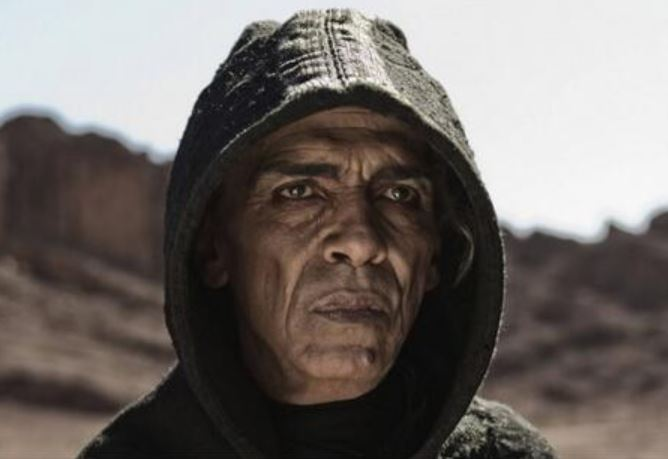
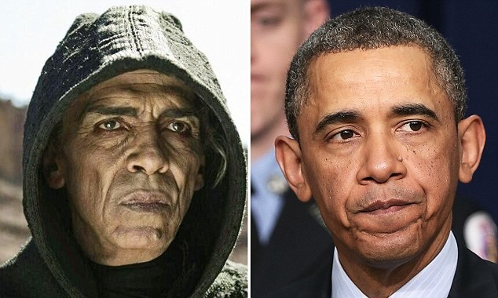

## *Of course* Obama is Satan

 * Originally posted at http://acephalous.typepad.com/acephalous/2013/03/of-course-obama-is-satan.html
 * Monday, March 18, 2013

Whether you believe that Mohamen Mehdi Ouazanni, the man portraying Satan in the Hitler Channel’s adaptation of _The Bible_, [looks](http://weaselzippers.us/2013/03/18/wonkette-history-channel-saying-all-black-people-are-the-devil-with-obama-look-alike/) [like](http://wonkette.com/506975/totally-great-the-bible-mini-series-explains-that-barack-obama-is-the-debbil) [President](http://mypetjawa.mu.nu/archives/215434.php) [Obama](http://althouse.blogspot.com/2013/03/why-does-devil-in-bible-look-exactly.html) depends on a number of factors, foremost among them your familiarity with people of other races. If, like many white conservatives, the majority of your interaction with people darker than you occurs when you
 watch the evening news, you see this image and are _shocked_ by the similarity:

Just look at his skin! The deep set eyes! The wide nose! His ears aren’t visible but surely they’re identical too! Except they aren’t. This is why I force my students to pay _very close attention_ to the actual frames they’re analyzing instead of relying on an uncritical sense of what’s being represented on screen. To wit:

I chose this comparison because it’s the one in which the likeness, such as it is, seems greatest. It’s important to note that it’s [from the conservative _Newsbusters_ site](http://newsbusters.org/blogs/howard-portnoy/2013/03/18/history-channel-s-devil-character-looks-president-obama), meaning that it’s been selected in order to heighten the featural similarities between them. The President’s lips aren’t always pursed, and choosing an image in which they are creates some features that wouldn’t otherwise be there, but for argument’s sake I’ll pretend this is how the President always looks.

We’ll start our comparison with the forehead: not only is Ouazanni’s deeply furrowed, the muscles above his eyebrows are far more defined.  Moving down to the glabella — the bit between the eyebrows — Ouazanni’s contains both vertical and horizontal furrows, whereas the President’s is smooth. Both have deep-set eyes, but Ouazanni’s are hooded and appear almost rectangular, whereas the President’s are almond-shaped. Beneath both of their eyes is a pronounced lower eyelid furrow which combines with an intraorbital furrow to create downward facing triangles on their cheeks. In this image, they both also have well-defined nasolabial furrows descending from the tips of their nostril wings out and around their lips to their chins, both of which are squarish. There are significant differences: Ouazanni’s cheeks are sunken, whereas the President’s are puffed; the shape and presentation angle of their nostrils is completely different, etc.

In other words, a simple description of the features of their face makes it possible to believe that they look somewhat similar — or that, as many on the right are arguing, Ouazanni looks like an older version the President. Except they don’t. The number of specific features a viewer needs to overlook — or be race-blind to — in order to claim a holistic similarity between the two is just too high.\*

If you want to see a connection, enough featural similarities exist for you to do so, but only if you make a conscious decision to equate an image of Satan in a hoodie with the President. The number of distinctions you must overlook is equaled by the number your cross-racial identification bias prevents you from seeing. Factor in whatever intuitive model of aging you use to crease the President’s forehead and wrinkle his cheeks and it’s clear that quite a bit of cognitive processing has gone into the “intuitive” association between these faces. Which means you ought to ask yourself:

_Why do I want to overlook these distinctions and age him in this way_?  The answer, obviously, is that you want to see what you think you see, and are probably upset that I’ve demonstrated how your “plain observation” has been filtered by political and racial recognition biases. So much so that your rebuttal will amount not to a refutation of the features I’ve identified, but by linking to the image again and insisting that anyone with eyes agrees with your holistic judgment. As Allahpundit admits, he now has “[a new front-page thumbnail for when Obama pushes an especially terrible policy](http://hotair.com/archives/2013/03/18/producers-of-the-bible-miniseries-no-way-were-we-trying-to-make-satan-look-like-obama/).” That’s all he really wanted in the first place.

\* I’m not saying there’s _no_ resemblance. Only that judgments about human faces are highly susceptible to suggestion, as analyzing them in detail, feature by feature, demonstrates.

* * *

I would have thought the long white wispy shock of hair also would have made it a bit harder to equate History Satan with Obama. I'm not watching the series, so I don't know what he looks like without the hood, and only know the actor is from Morocco. But if he has long grey hair under that hood, I'm betting Satan strikes a much different figure.

I'm only half-following this story because it's distasteful but can't be avoided if you're online, but didn't the whole thing get started with Glen Beck tweeting out the picture? Is it just this one frame of the show that's being used to make the equation? Or does he consistently resemble Obama in a way that suggests it was purposeful? I'm asking because I'm not going to watch to find out. The History Channel gives me enough headaches.

Posted by: mxyzptlk | [Tuesday, 19 March 2013 at 01:34 AM](http://acephalous.typepad.com/acephalous/2013/03/of-course-obama-is-satan.html?cid=6a00d8341c2df453ef017c37e509c1970b#comment-6a00d8341c2df453ef017c37e509c1970b)

* * *

I don't think he tweeted this particular picture, but I do think this frame was chosen because of the "resemblance," such as it is. But yes, the History Channel, misnomer, etc.

Posted by: [SEK](http://acephalous.typepad.com/) | [Tuesday, 19 March 2013 at 03:26 AM](http://acephalous.typepad.com/acephalous/2013/03/of-course-obama-is-satan.html?cid=6a00d8341c2df453ef017c37e618b7970b#comment-6a00d8341c2df453ef017c37e618b7970b)

