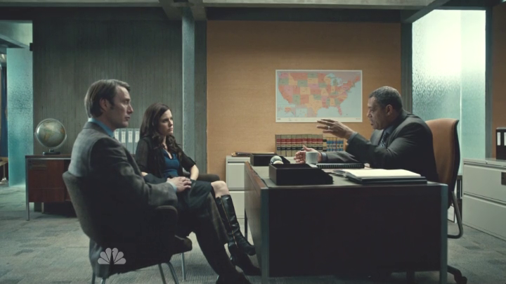
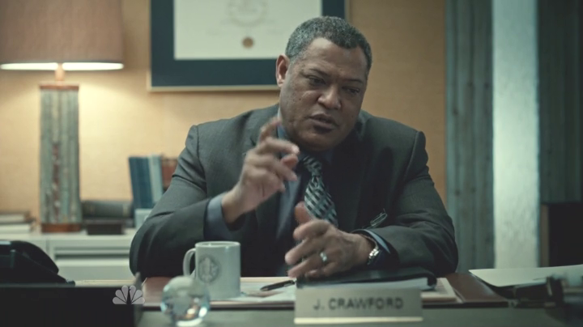
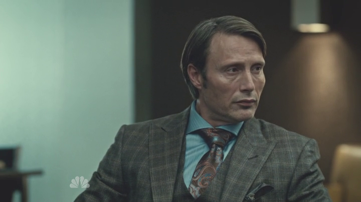
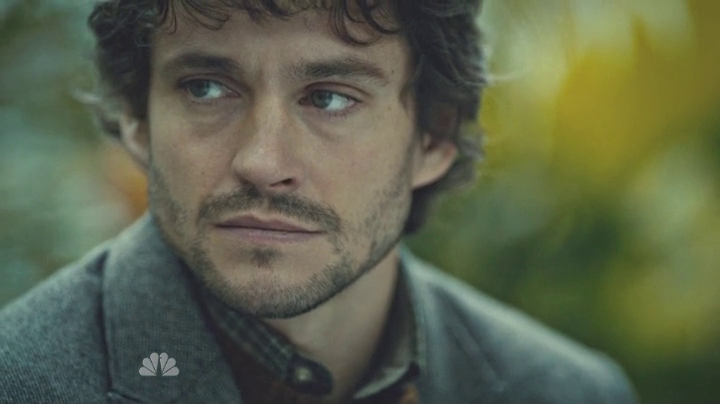
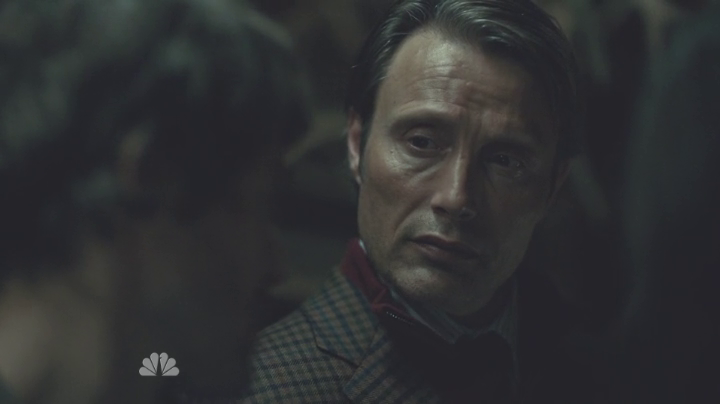
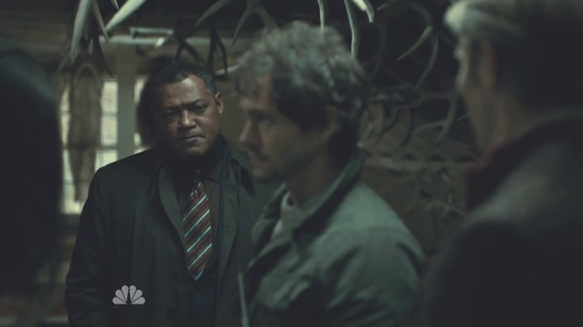
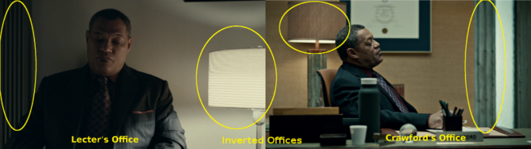

## Surprisingly, not unwatchable: <em>Hannibal</em>

 * Originally posted at http://acephalous.typepad.com/acephalous/2013/04/surprisingly-not-unwatchable-hannibal.html
 * Sunday, April 28, 2013

(_There's a television show in the title. How could it not be [yet another one of those posts](http://acephalous.typepad.com/acephalous/2012/02/scott-eric-kaufmans-visual-rhetoric-compendium-as-of-11282011.html)?_)

I say “surprisingly” because the show’s producer — and at this point, principle director — is [David Slade](http://www.imdb.com/name/nm1720541/) and [I’m not exactly a fan of his work](http://acephalous.typepad.com/acephalous/2011/03/how-to-ruin-thirty-days-in-a-night.html). That means _Hannibal_ is a litmus test for my brand of [auteur theory](http://en.wikipedia.org/wiki/Auteur_theory), because I’m genuinely impressed by some of his work here _and_ consider him a derivative hack with all the subtlety of a nine-year-old learning to play the trumpet: whatever talent he possesses is masked by the fact that _all he can do is blow_. I took the fact that he does so [as hard as he can for as long as he can sustain his breath](http://www.amazon.com/exec/obidos/ASIN/B001UV4XFG/diesekoschmar-20) as a fairly damning character flaw. But _Hannibal_ suggests he may have finally learned something.

For those of you who know nothing of American popular culture, _Hannibal_ is a show about a man named [Hannibal Lecter](http://en.wikipedia.org/wiki/Hannibal\_Lecter). He’s a serial killer who loves playing psychological games with know-it-all FBI agents. That’s the show’s motivating irony: he’s contacted by the FBI to provide psychiatric support for their most gifted criminal profiler. He’s solving crimes! While copycatting them! Talk about dramatic irony! 

The point being that this is a show about people with deep insight into the thought and behavior of sociopaths who fail to notice that their consultant’s therapist is one. It’s a show about psychological isolation — about people who can’t interact with the world or the people who inhabit it because there’s a felt distance between themselves and their humanity. So it only makes sense that even when they’re together, they’re alone. In “Potage,” for example, Lecter meets with the head of the FBI’s behavioral science division and one of their top 
psychiatrists:

The long shot establishes that they’re all in the same room, which is important because if it didn’t, you might not realize that. The conversation proceeds via a series of medium close-ups in shallow focus:

The [depth of field](http://classes.yale.edu/film-analysis/htmfiles/cinematography.htm#38662) is so shallow that the items on the front of his desk as unfocused as the wall behind him. His body occupies the thin slice of the world that the camera and lighting conspire into focus. Same with her:

And with him:

The three of them are sitting in the same room but are connecting neither with it nor each other. Their psychological isolation is being represented by the thin slice of the diegetic world that happens to be in focus. How thin is it?

Thinner than _this man’s face_. It’s almost as if this man — the aforementioned criminal profiler — doesn’t even understand himself.  Maybe he should see somebody about that.

That’s right — he already is and it’s not working. You can tell because even when Slade switches from medium close-ups that suggest that all men are islands to two-shots that should suggest companionship, the thin depth of field isn’t even ample enough to include both subjects in focus. How isolated does Slade want these people to seem? Even when they’re four of them _in the same frame_ he racks the focus from one to another depending on who’s talking:

Sticking four people in a frame and creating a sense that they’re talking _at_ rather than _to_ each other requires a deft touch I didn’t think Slade possessed. It’s not exactly unsubtle, but it effectively creates a mood that untrained viewers would describe as “creepy” without exactly knowing why. Instead of the shallow focus functioning as it normally does — to focus the audience’s attention on one element in the composition — the cumulative effect of these shots is a claustrophobia tinged with obsessive attentiveness. The world is small and largely unfocused except for this little slice of clarity. And on _Hannibal_, as often as not that little slice of clarity contains corpses mutilated by someone with an eye for composition. The mundane world of homes and offices and other people exists only in an unfocused and isolating haze; the frail horror of artfully desecrated bodies is sharply in focus.

* * *

The thread's inert over at LGM, but another nugget that jumped out at me was the way Hannibal's and Crawford's offices are inverted on a close-up shot of Crawford. When Crawford is in Hannibal's waiting room, there's a lamp to his left and vertical molding to his right. In the next scene, we start with Crawford at his desk, and there's a lamp to his right and vertical molding to his left -- and inversion of the shot in the previous scene. That seemed like a deliberate choice, since both offices are the thinktanks where the shows' crimes are being considered, both are bases where the operators are using Graham as a tool to solve these crimes, yet both are using their offices and Graham to very different ends, yet through similar means. Let's see if this works:

([Bigger image here](http://s21.postimg.org/ibekj6h1j/hannibal_office_inversions.png).)

With regard to the slim slices of reality, I think there's something else happening on top of that: When Graham's in one of his fever dreams, or is putting himself in the mind of a killer, the depth of field is much greater -- almost the entire room has clarity and focus. This isn't consistent (I just looked at a couple of those scenes), but in ep. 4 (which didn't air in the U.S.) there's a scene where he's imagining what the killer saw in a family's home while they're sitting down to dinner, and the entire dining room is in sharp focus.

Posted by: mxyzptlk | [Tuesday, 30 April 2013 at 06:55 PM](http://acephalous.typepad.com/acephalous/2013/04/surprisingly-not-unwatchable-hannibal.html?cid=6a00d8341c2df453ef017eeab6f3eb970d#comment-6a00d8341c2df453ef017eeab6f3eb970d)

* * *

Well I'll be good God-damned. That's brilliant. I'm about to watch episodes four and five for the Big New Job at the Big New Place and I'll definitely steal/credit this in it. 

Posted by: [SEK](http://acephalous.typepad.com/) | [Tuesday, 30 April 2013 at 07:02 PM](http://acephalous.typepad.com/acephalous/2013/04/surprisingly-not-unwatchable-hannibal.html?cid=6a00d8341c2df453ef017eeab6feb6970d#comment-6a00d8341c2df453ef017eeab6feb6970d)

* * *

Wait -- the Big New what in the where now?

Posted by: mxyzptlk | [Tuesday, 30 April 2013 at 07:48 PM](http://acephalous.typepad.com/acephalous/2013/04/surprisingly-not-unwatchable-hannibal.html?cid=6a00d8341c2df453ef01901bb9bb2e970b#comment-6a00d8341c2df453ef01901bb9bb2e970b)

* * *

I think you should be able to see this. Don't want to put it out there entirely yet, as there are letters to be crossed and dotted.

Posted by: [SEK](http://acephalous.typepad.com/) | [Tuesday, 30 April 2013 at 08:00 PM](http://acephalous.typepad.com/acephalous/2013/04/surprisingly-not-unwatchable-hannibal.html?cid=6a00d8341c2df453ef01901bb9cbb9970b#comment-6a00d8341c2df453ef01901bb9cbb9970b)

* * *

The link didn't work -- no worries. But I did zip through your timeline, and that Paul Westerberg/No Replacements Found post made my night. 

Also need to get my act together, because I have some questions for you and Attewell about the relation between the romantic epic, fantasy lit, fascism, and George R. R. Martin.  

Posted by: mxyzptlk | [Tuesday, 30 April 2013 at 10:31 PM](http://acephalous.typepad.com/acephalous/2013/04/surprisingly-not-unwatchable-hannibal.html?cid=6a00d8341c2df453ef01901bba8071970b#comment-6a00d8341c2df453ef01901bba8071970b)

* * *

Woo Hoo. "letters to be crossed and dotted." sounds like (hopefully) imminent good news.

Posted by: [NickS](http://www.beforeyoulisten.com) | [Thursday, 02 May 2013 at 06:37 PM](http://acephalous.typepad.com/acephalous/2013/04/surprisingly-not-unwatchable-hannibal.html?cid=6a00d8341c2df453ef017eeac67082970d#comment-6a00d8341c2df453ef017eeac67082970d)

* * *

It's all up to me now. If I don't fuck it up, I'll have my own "Internet Film School" at the most prestigious bulb-vegetable-themed site on the Internet. I'm actually writing my "pilot post" for it right now, and should have it done by tomorrow. Just in case you wonder how I feel about this, I've woken up every morning for the past week at 4 a.m. and, instead of turning over and going back to sleep like a human being, I've gotten up and started writing. That's how excited/tired I am.

Posted by: [SEK](http://acephalous.typepad.com/) | [Thursday, 02 May 2013 at 07:24 PM](http://acephalous.typepad.com/acephalous/2013/04/surprisingly-not-unwatchable-hannibal.html?cid=6a00d8341c2df453ef017eeac6a943970d#comment-6a00d8341c2df453ef017eeac6a943970d)

* * *

_the most prestigious bulb-vegetable-themed site on the Internet_

It's funny, not immediately recognizing the site in question my brain keeps arriving at "courceler(y)a". I do know that celery isn't a root vegetable.

Posted by: [NickS](http://www.beforeyoulisten.com) | [Thursday, 16 May 2013 at 07:16 PM](http://acephalous.typepad.com/acephalous/2013/04/surprisingly-not-unwatchable-hannibal.html?cid=6a00d8341c2df453ef019102394d9e970c#comment-6a00d8341c2df453ef019102394d9e970c)

