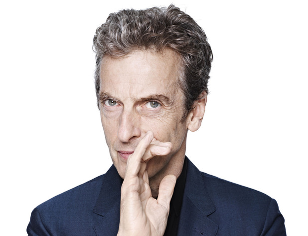

## The New Doctor

 * Originally posted at http://acephalous.typepad.com/acephalous/2013/08/the-new-doctor.html
 * Monday, August 05, 2013

As anyone who cares enough to be reading this already knows, yesterday the BBC announced that it had [cast the new Doctor](http://www.bbc.co.uk/news/entertainment-arts-23570354), and to the shock of absolutely no one paying attention, he looks like this:

I confess to being disappointed: I’d hoped to see Idris Elba fulfil the Doctor’s wish of regenerating ginger—yes, you read that correctly—because a show whose operative principles are any thing, any where, any time shouldn’t limit its protagonist to white men from the British Isles. Endlessly doing so constitutes a failure of imagination on the part of a show predicated on imaginative possibility. I’m not claiming the new Doctor had to be a black man. Neil Gaiman introduced into canon the concept of regenerating into another gender in “The Doctor’s Wife,” so I would’ve been satisfied with a white woman.\*

Essentially, I wanted Steven Moffat to make a selection as outrageously ambitious as the show itself can be, and Peter Capaldi is more of the same. Which isn’t to say he’ll be a terrible Doctor, as Capaldi’s a fine actor and will bring to the role a gravitas it’s lacked since the end of David Tennant’s run. But as heroes go, the Doctor’s just “a madman with a box” whose power, such as it is, is the ability [to bluff his way out of a war](http://acephalous.typepad.com/acephalous/2011/11/doctor-who-the-pandorica-opens.html). And as powers go, “intelligence” is limitless in its potential appeal _because everyone likes to think they’re smart_.  Having him embodied by an endless parade of white British males creates
 an unwholesome and unnecessary connection between intelligence, acts of extreme whiteness and penises.

Why does that matter? I’ll tell you the same story I told [my _Doctor Who_ class](http://acephalous.typepad.com/acephalous/doctor-who/) when trying to explain its cultural significance to the British people:

One evening while I was trapped in North London by an Icelandic volcano, I noticed the streets were unusually empty. The hundreds of Pakistani children usually found playing in the street had vanished, so I decided to take advantage of the quiet and read on the front porch.  About five minutes later, the Pakistani family that lived next door returned home from wherever they’d been and went inside. Five minutes after that, another Pakistani family from down the street walked up to and in my neighbor’s house. Five minutes after _that_, another Pakistani family, this one completely unfamiliar to me, did the same.  This continued for about an hour, until the house was packed well beyond capacity.\*\* I had no idea what was going on, so when one of the children I recognized was walking up, I asked.

“What’s going on?”

“The Doctor,” he said.

Imagine what the atmosphere in that house would be like if 
Matt Smith regenerated into someone who resembled them. Because that’s 
all you can do, _imagine_, for the time being.

\* I’ve read that some are disappointed that the Doctor will be 
straight again. I sympathize—though the series deserves credit on that
 front for Captain Jack—but unless they have access to scripts Moffat 
hasn’t written yet, I’m not sure why anyone would conclude from 
Capaldi’s casting that the Doctor will be straight.

\*\* Writing this story down is, believe it or not, the first time I’ve ever realized that _the house was bigger on the inside_.
 I’ve always worried people would think I was making some sort of 
derogatory statement about the living conditions of Pakistanis, when I 
should’ve been making it clear that they have a TARDIS and we don’t.
		
* * *

So a black man or a white woman would've been different, but an older man is "more of the same" compared to his two young predecessors? Where I come from we call that ageism. 

Posted by: Gass | [Monday, 05 August 2013 at 10:52 PM](http://acephalous.typepad.com/acephalous/2013/08/the-new-doctor.html?cid=6a00d8341c2df453ef01901ea3cf88970b#comment-6a00d8341c2df453ef01901ea3cf88970b)

* * *

This is somewhat beside the point, but if you actually thought that Idris Elba was going to be cast, you're mental.  Its cultural significance and centrality aside, Doctor Who is a _regular BBC drama_, which means that the lead actor has to commit to showing up -- on set and at a variety of locations around the British Isles and occasionally further afield -- every day for several months, and he's going to be paid BBC wages to do it.  In addition, whoever plays the Doctor is signing on for minimally weeks to months of promotional work: fan conventions, photo shoots, etc etc.  And because re-casting the role is such a heartache for everyone involved in the production staff, the BBC wants a multi-year commitment.

None of which is even slightly compatible with _also_ shooting 3-4 Hollywood feature films a year.  In fact, based on Eccleston and Tennant's luck so far, it may be one of the surer ways to flat-out kill a promising career in Hollywood.  Elba's Hollywood career hasn't reached Tom Cruise levels yet, but he's looking like he's on that track, and his commitments there have limited the last two series of Luther to 4-6 episodes a year: Doctor Who averages 2-3 times that.  

TL;DR -- Elba doesn't have the time, and the BBC could never afford what they'd need to pay him to clear his schedule.

Posted by: [Doctor Memory](http://blahg.blank.org) | [Tuesday, 06 August 2013 at 10:06 PM](http://acephalous.typepad.com/acephalous/2013/08/the-new-doctor.html?cid=6a00d8341c2df453ef0192ac67ed82970d#comment-6a00d8341c2df453ef0192ac67ed82970d)

* * *

As I understand it, the role _was_ offered to a black actor before Capaldi, but the actor turned it down (and doesn't want to go public about it). [I believe Gaiman broke that news](http://www.telegraph.co.uk/culture/tvandradio/doctor-who/10227458/Doctor-Who-writer-Neil-Gaiman-A-black-actor-turned-down-the-role.html). So there's that.  

Take this for what it's worth, but Rob Bricken at IO9 attempted to forge a "[unified theory to explain the casting of every new Doctor Who](http://io9.com/a-unified-theory-to-explain-the-casting-of-every-new-do-1054287288)" that posits stages of the rebooted Doctor Who that need to be gone through before this iteration of the program is free to go in other directions (and Bricken was similarly hoping for a gender or ethnic change-up, so this is in retrospect). The short version is the original Doctor went through some historic stages that we can recognize, and the new Doctor is working through similar layered stages while modernizing in order to break free of its past: The Dark Doctor (Eccelston); The Charismatic Doctor (Tennant); The Weird Doctor (Smith); and The Elder Doctor (Capaldi). After Capaldi, the Doctor has been rounded out to resonate with the original Doctor characters, and anything goes. 

But I'm in agreement with those that do _not_ want to see Moffat writing a female Doctor. He can barely handle female cyphers.

At this point, I'm most concerned with what his new catchphrase will be. If Capaldi plays him Scottish, there's always _OCH! GUID!_ Or maybe _OAN YE GO BIG MAN!_ If Capaldi channels his inner Malcolm Tucker, then there's _Omnishambles_, _FUCK!_ (probably not), or maybe when someone's trying to get into the Tardis, he can pull out the classic _Come the fuck in or fuck the fuck off!_

Posted by: mxyzptlk | [Wednesday, 07 August 2013 at 08:03 PM](http://acephalous.typepad.com/acephalous/2013/08/the-new-doctor.html?cid=6a00d8341c2df453ef0192ac6c9e85970d#comment-6a00d8341c2df453ef0192ac6c9e85970d)

