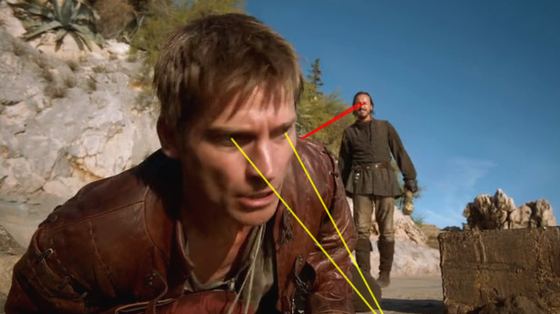

## SEK’s <em>Game of Thrones</em> recap: Now with more eye lasers!

 * Originally posted at http://acephalous.typepad.com/acephalous/2014/04/seks-game-of-thrones-recap-now-with-more-eye-lasers.html
 * Monday, April 28, 2014

It’s [the only _Game of Thrones_ recap worth reading](http://www.rawstory.com/rs/2014/04/28/recap-game-of-thrones-season-four-episode-four-oathkeeper/) even if you’ve already seen the episode.

About which — I’m still not entirely sure why people like to read recaps of shows they’ve already seen, but people clearly do.

I must be the outlier here.

* * *

I thought twice about checking in just to argue... but why not.  People read recaps for the same reason they read criticism of a book they've just read, to see if a reading of it by a critic will give them a different way of thinking about it, and point out things they've missed.  Of course you know this, so are you indicating tension about what you're writing, or what the format is constraining you to write?

Because the whole eye laser thing ... well, to me it seems like literary criticism that focuses on reading all works via sentence structure.  "Look," you say to your surrogate students, "Some sentences are long, and some are short.  The short ones indicate action!  The long ones are kind of a long, discursive ramble, suitable for descriptions and areas in which the writer wants to slow things down."  Yes, that's all true, but haven't they gotten it already?  Eye height and gaze direction, very important, used by directors to produce intended effects.  The whole Valve experience taught the participants many things (such as: none of the intended purposes for the blog would really work) but it also did show that repeated interaction with interested people could lead to some progress in what you could talk to those people about.

I looked back over the last few recaps and saw the one in which you mentioned the Ember Island Players episode of Avatar: The Last Airbender as being similar to the episode in Joffrey is poisoned in that both have the audience rooting for the death of a child.  And I read the completely predictable comment thread.  And it's possible to have a really long argument about this, especially if you look in detail at what that Ember Island Players episode was trying to do, but it seems that you're writing in a place where that can't happen.  Is that a solid constraint?

Posted by: [Rich Puchalsky](http://profile.typepad.com/puchalsky) | [Monday, 28 April 2014 at 10:13 PM](http://acephalous.typepad.com/acephalous/2014/04/seks-game-of-thrones-recap-now-with-more-eye-lasers.html?cid=6a00d8341c2df453ef01a511ab9f8a970c#comment-6a00d8341c2df453ef01a511ab9f8a970c)

* * *

_I thought twice about checking in just to argue..._

You're always welcome here, Rich, and it's good to hear from you. I worry, you know.

 _People read recaps for the same reason they read criticism of a book they've just read, to see if a reading of it by a critic will give them a different way of thinking about it, and point out things they've missed._

I guess it's the genre -- a recap isn't really criticism, except in the passive way that all summaries necessarily involve a process of selection, _i.e._ what plot elements are considered important enough to worth mentioning or lingering on. 

_so are you indicating tension about what you're writing, or what the format is constraining you to write?_

More the latter than the former. I always taught summary as the first step of criticism, so now that I'm a journalist, I'm starting to feel like I'm writing the first draft of history -- even if it is the history of a television show.

 _Yes, that's all true, but haven't they gotten it already? Eye height and gaze direction, very important, used by directors to produce intended effects._ 

I don't think so, or at the very least, people don't seem want to slow down themselves enough to produce the close-reading of a scene, but are more than happy to read a close-reading of one once I do it. In fact, they're clamoring for it -- my inbox is full of requests for me to break down the Purple Wedding in a Zapruder-like fashion to figure out whose gaze met whose and said what, etc. And I'm about half-way done with it, because it's incredibly complicated -- so on the one hand, yes, this is the sort of basic stuff that people intuitively understand, but on the other, the more complex the scene becomes, the more difficult it is to read intuitively, so breaking it down via eye-lasers becomes an exercise similar to what I did with [the Keats almost a decade ago](http://acephalous.typepad.com/acephalous/2006/11/all\_in\_all\_a\_de.html). 

_it also did show that repeated interaction with interested people could lead to some progress in what you could talk to those people about._

Writing for Raw Story and the AV Club necessitate thinking about audience differently. It helps that the AV Club is actually called "The Internet Film School," but I'm still being asked to develop the readings very slowly, so that anyone new to it can still understand what's going on. And the Raw Story is journalism, except for the recaps, but the recaps are their own animal, as discussed above.

Ideally, I'd have enough time to do the basic breakdowns at Raw Story and the AV Club, then do more complex analyses that assume that people remember what I've written previously here and at LG&M, but I lack the energy at the moment. Doing nothing but sitting at a desk writing for nine or ten hour shifts makes one less inclined to want to sit at a desk and write -- especially when I'm working on a novel at the same time, and want to save some energy for that.

_And it's possible to have a really long argument about this, especially if you look in detail at what that Ember Island Players episode was trying to do, but it seems that you're writing in a place where that can't happen._

I'm not going to say it _can't_ happen, only that it hasn't yet. There have been some great comment threads at the AV Club, for example, ones that rival some of the best I've had anywhere online. I think once people come to expect my recaps at Raw Story, they'll start to understand what I'm getting at and start pushing me more, but that's just a matter of building an audience. 

That said, as sites as large as Raw Story, you sort of have the audience you have, not the one you deserve (or think you deserve), just as a matter of scale. 

Posted by: [Scott Eric Kaufman](http://profile.typepad.com/scotterickaufman) | [Tuesday, 29 April 2014 at 06:52 AM](http://acephalous.typepad.com/acephalous/2014/04/seks-game-of-thrones-recap-now-with-more-eye-lasers.html?cid=6a00d8341c2df453ef01a3fcfc2be3970b#comment-6a00d8341c2df453ef01a3fcfc2be3970b)

* * *

Well, here's the outline of the Ember Island Players argument: the differences between the two cases outweigh the surface similarity.  It comes down to an interpretation of why the show is showing that scene (i.e. the kind of thing that a focus on eye-lasers tends to displace).

In Ember Island Players, the people cheering for the death of a child aren't us, the real audience -- we're not encouraged to even cheer for the death of the Firelord, an adult (as Aang's extended agonizing about whether to kill him makes clear). Nor is this audience the Avatar and friends (who stand in, in that episode, for the show creators reacting to fan interpretation of the show).  The people cheering are from the Land of Fire, pleased by the patriotic ending in which the Avatar is defeated.  Since it's about the most downplayed death-in-a-play ever, with the actor playing the Avatar remaining sickeningly cheery until the very end, the effect is to make the cheerers look pretty deluded.

The Avatar and friends are aghast at this reminder that the story may turn out badly for them.  But we the actual audience of the show know that it can't actually end badly.  The major characters are not going to all be wiped out by the Firelord, not in a children's show.  They're going to win.  But the audience within the show think that they are watching a similarly pre-plotted story in which the Firelord has to win.  The end effect is to encourage the idea that there may be multiple potential endings for this story -- something that goes along with the reaction to fans and their fan stories about the series in which different people are paired off.

I haven't seen the Game of Thrones episode; I've only read the book.  But, taking the book as a guide, here the author is emphasizing that there can be only one story.  It's said over and over within the series: when you get involved in the Game of Thrones you can't lose or leave, you only either win or die.  Joffrey is a weak king and his death scene is therefore inevitable.  You may have sympathy, as the viewer did for the Stark contenders when they lost, or you may feel like a sadist got his just deserts, but how you feel isn't going to change what's happened in the story.  (In the TV series, at least, both Robb Stark and Joffrey are 19 when they die, supposedly).

Why does George R.R. Martin do this?  It's central to the apparent purpose which I imagine animates the series, which is that he's authorially pissed off that little girls want to be princesses and little boys want to be knights, and wants to depict a "real history" in which the brutality of their lives can't be separated out from the fantasy.  One of the many keys is the scene in which the Hound describes how he played with his brother's toy -- a wooden doll of a knight -- and his brother angrily pushed his face into the flames with no one there able to stop him.  Joffrey's problem isn't that he's sadist -- there are plenty of successful ones in the series -- it's that he doesn't use his sadism instrumentally, to create useful fear at the right time, but instead uncontrollably, making mistakes and alienating people.  The winner at the game of kings can't have vices or virtues that aren't turned towards the business of kingship.

Does the TV series play up cheering for Joffrey's death in a way that the book doesn't?  I don't know; haven't seen it.  Btu the book's politics make the scene necessary, in pretty much the exact same way that the Red Wedding was necessary, and that's diametrically opposed from Avatar's emphasis on a multiplicity of possible outcomes.  It's not fundamentally a good comparison except at the most summarized level.

Posted by: [Rich Puchalsky](http://profile.typepad.com/puchalsky) | [Tuesday, 29 April 2014 at 06:35 PM](http://acephalous.typepad.com/acephalous/2014/04/seks-game-of-thrones-recap-now-with-more-eye-lasers.html?cid=6a00d8341c2df453ef01a3fcfd439b970b#comment-6a00d8341c2df453ef01a3fcfd439b970b)

